## 分类模型与排序模型在推荐系统中的异同分析  

> 作者: DataFun社区  
> 发布日期: 2019 年 4 月 29 日  

### 前言

推荐系统是驱动内容分发的引擎，而个性化则是推荐系统的核心思想。分类模型和排序模型是业界常用的两种个性化建模方式。本文探讨两种方法的异同点，总结如下：

1. 分类模型回答的是用户喜不喜欢这个物品，而排序模型回答的用户更喜欢哪一个；
2. 在对事件发生的假设上，分类模型认为个样本之间相互独立且服从相同的分布，排序模型认为同组内部的样本是有关联关系和可以相互比较的；
3. 从 Bayesian 的观点来看，分类模型刻画的是 <user,item> 的联合分布 P\(user,item\)，而排序模型刻画的是条件分布 P\(item|user\)；
4. 从参数更新上来看，分类模型的参数更新由特征的绝对值确定，而排序模型由不同样本之间的特征的相对值确定。

### 背景知识

#### 二项分布

在二项分布中事件只有两个取值 \{0,1\}，1 表示事件发生，0 表示未发生。其中事件发生的概率为 _p_ ，不发生的概率为 1-p，用公式表达事件发生或者不发生的概率：

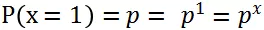

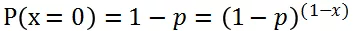

将上述两个式子联合在一起写：

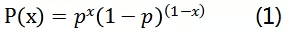

#### 分类模型与二项分布

分类模型试图回答这样一个问题：如果一个事件具备特征 x，那么根据以往的经验（和统计），事件为真的概率 \(P\(x=1\)\) 是多少？

为了回答这个问题，分类模型使用了两个函数，第一个函数将特征描述 x 映射为一个实数：

第二个函数将 \_f\(x\)\_ 映射为概率：

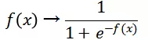

个人理解使用 sigmoid 函数, 有以下优点：

1. 取值范围在 \[0,1\] 之间，符合概率定义的区间范围。
2. 这种变换让 f\(x\) 有明确可解释的物理意义：对数几率

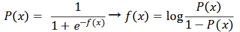

即 \_f\(x\)\_ 的物理意义是事件发生与否之比的对数。

3. f\(x\) 值过大或者过小时 sigmoid\(f\(x\)\) 的导数趋近于 0，不会因为异常值导致模型难于收敛。

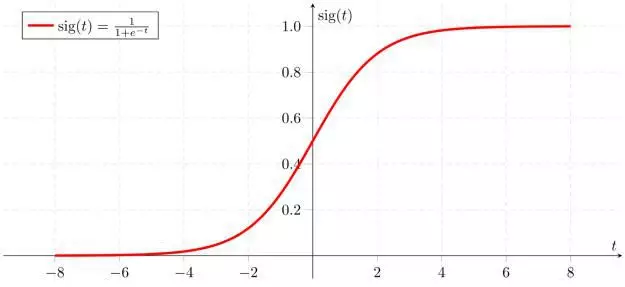

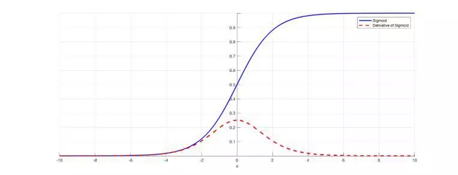

sigmoid 函数 \(上\) 及其导数 \(下\) 曲线

经过上述两次变换以后分类模型将一个特征描述 x 转换为一个概率值 P\(x\)，下一步的工作是在训练集上让点击数据的 P\(x\) 接近于 1，而未点击数据的概率值接近于 0。我们引入辅助变量 P’\(x\)，对于点击事件定义其值为 1，非点击事件定义其值为 0。所以我们要做的是在训练集上让 P\(x\) 接近于 P’\(x\)

对于点击事件，最大化：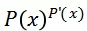，对于非点击事件最大化
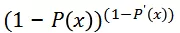

两者合并，无论对于点击还是非点击事件，我们都是在最大化：

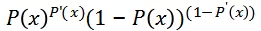

上述表达式在作用在一条日志上， 对于整个数据集我们最大化的是：

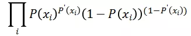

因为连乘数值计算存在精读损失问题，所以我们进行对数变换：

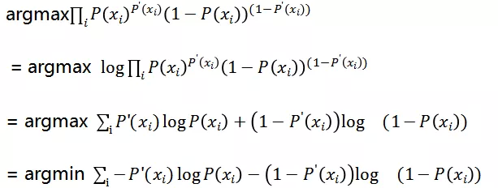

即分类模型的优化目标为：

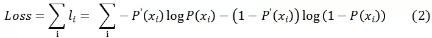

#### 排序模型

排序模型有多种实现，本篇文章只讨论 Pairwise 模型。在 Pairwise 模型中，首先对数据分组，在搜索中每次搜索是一个组，在推荐中可以根据请求 ID 分组，也可以根据用户 ID 分组，哪种效果更好需要看具体使用场景。

类似于分类模型，我们也是让模型的输出结果与真实事件一致，只不过这里的事件不是点击与否的单个事件，而是偏序关系是否成立这个事件。类比分类模型，我们定义以下变量：

用户对 i 的反馈是否比 j 更好。

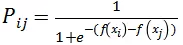：模型对文档 i 的打分 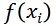 要比对 j 的打分 

 更高的概率。

优化函数可以类比分类模型得到：

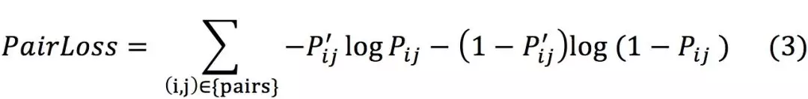

### 分析比较

#### 两种模型输出值的物理意义

根据分类模型和排序模型的建模过程可知，分类模型的输出值 f\(x\) 为正负概率比值对数，对其求 sigmoid 函数以后就是事件发生的概率。而排序模型的分数值却不能直接和输出概率等价，只能将不同文档的分数放在一起进行比较认为用户可能更喜欢哪一个。从这个观点来看，分类模型不要求输出概率绝对正确，而只要求相对关系正确。因此分类模型要对两个样本都有准确的预估才能保持正确的偏序关系，其要求更高；而排序模型是分类模型的一个简化版本，只要求偏序关系的正确，并不要求预估值的绝对准确。一个完美的分类模型必然会是一个完美的排序模型，反之不然。在机器学习领域我们知道存在“天下没有免费的午餐”定律，在相同的数据集下，如果对模型的要求更高，那么必然要付出更多的代价。如果付出的代价一定（数据集相同，底层模型一致），一个更简单的模型效果可能更好。

#### 事件之间的相互独立性假设

分类模型（公式 2）的总体惩罚值是各个样本惩罚值之和，样本之间的惩罚值没有显示关系；排序模型（公式 3）的总体惩罚值是各个 Pair 之和，一个 Pair 内部的惩罚值之间有相互关系，要求两者对比关系显著。因此分类模型建立在每个样本相互独立的基础上，而排序模型建立在同组样本可相互对比的基础上。结合推荐系统的具体使用场景，用户其实是主动挑选了更感兴趣的内容，因此上述比较是更符合客观情况的，另外用户在选择买还是不买 / 看还是不看的时候不排除有“货比三家”的心智模型，对内容进行比较之后再进行消费（时间或者金钱），考虑到这些因素，排序模型更能反映客观世界的真实情况。

#### 参数更新方式的区别

假设模型的参数为 w，损失函数对参数的导数为：

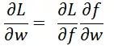

因此 Pointwise 参数更新：

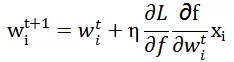

Pairwise 参数更新：

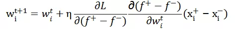

其中 
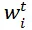
 为参数 w 的第 t 次迭代结果，x\_i 是第 i 个特征。

（注：上述公式满足的前提条件是
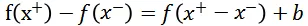
，FM 等线性模型满足此条件。）

由上述更新公式可以看出，pointwise 的参数由文档特征的绝对值确定。 而 pairwise 的参数由文档相对文档特征确定。对于统计特征，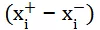 要比 
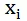
 低一到两个数量级，比如点击率的差 0.11 – 0.10 = 0.01。也就是说 pairwise 模型降低了模型对统计特征的敏感度。对于 ID 特征，如果用户点击和展示的是不同的文档，其语义信息不一样，所以：

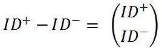

每个参数都会被正常更新（这里 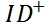 表示正样本的语义向量，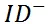 表示负样本的语义向量）。 但是如果用户一直沉溺在类似的文档中，比如标题中都含有类似的色情词，他们的语义向量会比较接近一些，因此 
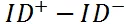
 近似于零向量，参数不会被更新，这些色情词就不会对模型造成影响。

综上，pairwise 模型相对于 pointwise 模型在抑制奇闻怪异，色情裸露文档方面有两个优点：

1. 降低了对统计特征的敏感程度。
2. 减小了沉溺用户对排序模型的干扰。

#### 联合概率 vs 条件概率

为了方便讨论，我们暂时换用 Hinge Loss 作为排序模型的惩罚函数：

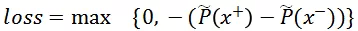

即模型对正样本 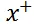 的打分高于负样本 
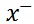
 时不予惩罚，反之惩罚值随着误判值线性增加。其中

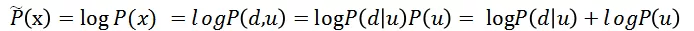

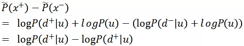

因此在 Hinge Loss 函数下排序模型建模的是条件概率，比联合概率少了 P\(u\) 的先验概率计算过程。如果 P\(u\) 的计算精确，那么计算联合概率和条件概率效果一样，如果 P\(u\) 计算有误差，那么省略掉 P\(u\) 的模型更鲁棒。再次套用“没有免费午餐定律”，其实排序模型是减小了模型的复杂度。

### 作者介绍：

邹敏，现任 Opera 高级算法专家。毕业于中科院，曾先后在微软和阿里巴巴大文娱工作过。对本文感兴趣的同学，欢迎与作者邮件交流：minzou@live.com

**本文来自 邹敏 在 DataFun 社区的演讲，由 DataFun 编辑整理。**
