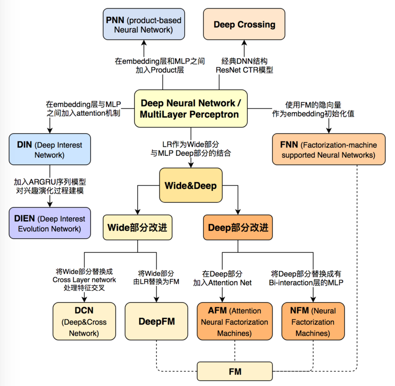
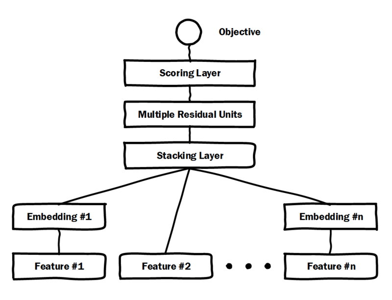
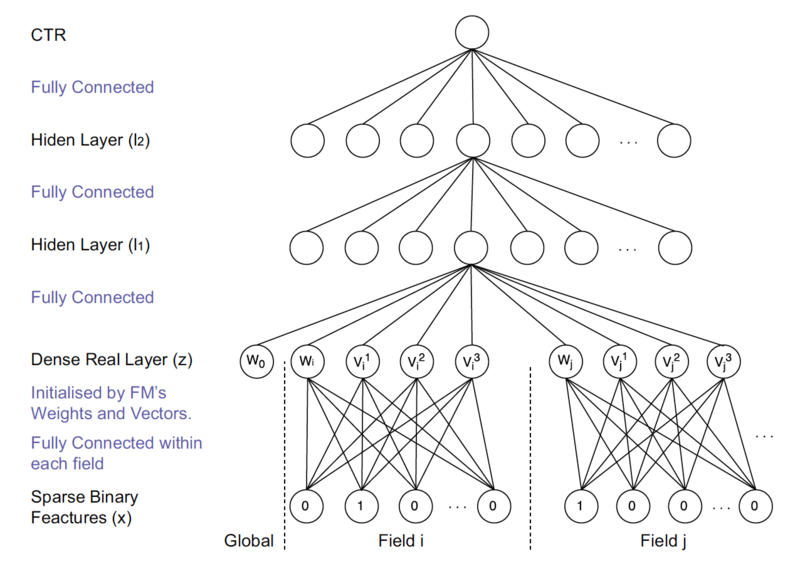
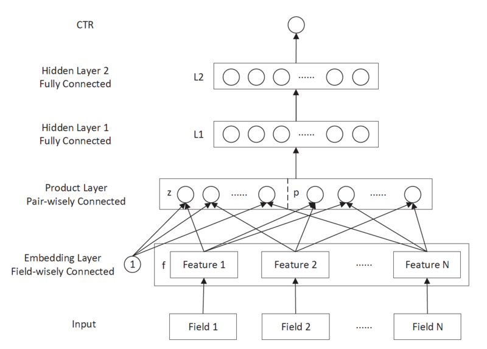
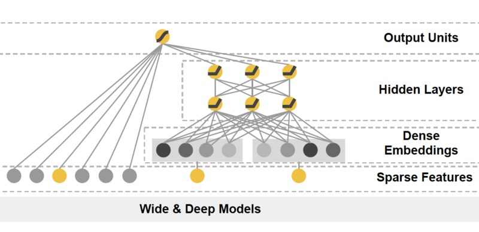
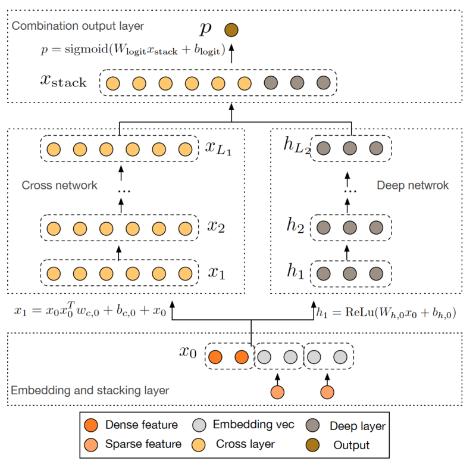
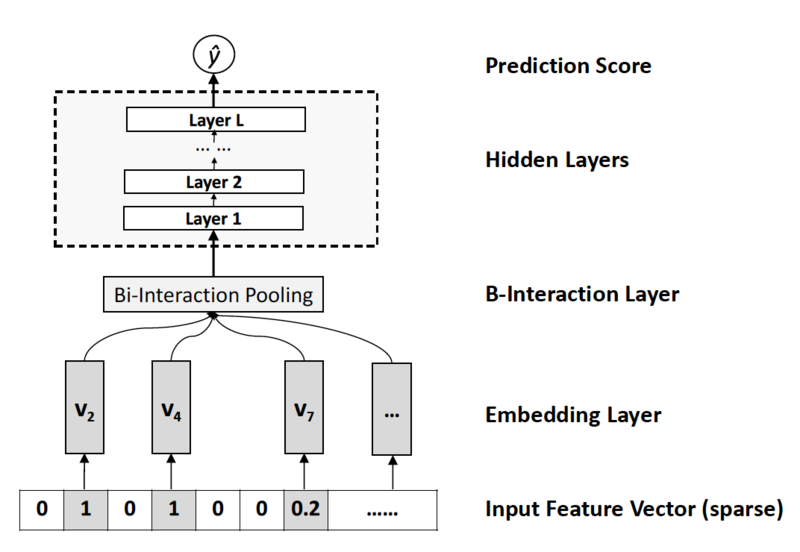
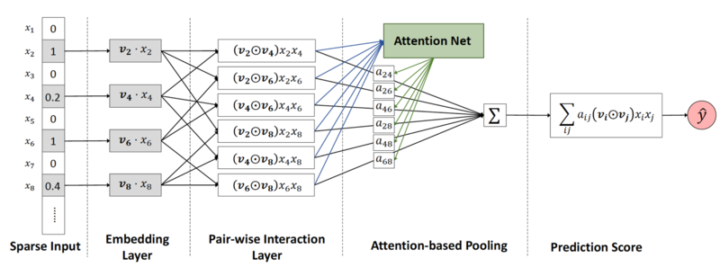
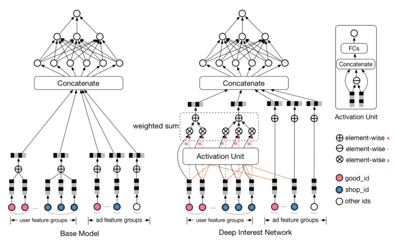
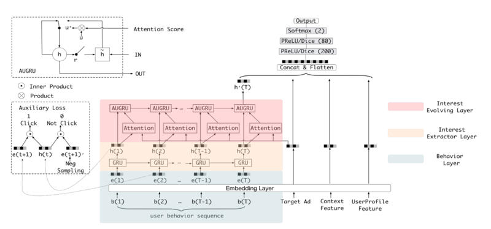

## 谷歌、阿里等10大深度学习CTR模型最全演化图谱  

> 作者: 王喆 ​  
> 发布日期: 2019 年 4 月 19 日  

本文是王喆在 AI 前线 开设的原创技术专栏“深度学习 CTR 预估模型实践”第四篇文章（以下“深度学习 CTR 预估模型实践”简称“深度 CTR 模型”）。回顾王喆老师过往精彩文章：[《重读 Youtube 深度学习推荐系统论文，字字珠玑，惊为神文》](https://mp.weixin.qq.com/s?__biz=MzU1NDA4NjU2MA==&mid=2247494669&idx=2&sn=b1ca666f647373b0de4be5da388e53bc&chksm=fbea55c2cc9ddcd4f909dd2ea65102d9e0637857dac813d35f71229d0c897a435077c987418f&scene=21#wechat_redirect)、[《YouTube 深度学习推荐系统的十大工程问题》](https://mp.weixin.qq.com/s?__biz=MzU1NDA4NjU2MA==&mid=2247494791&idx=2&sn=643df72a5116807136e07a82db83b9cd&chksm=fbea5548cc9ddc5e07baffe20d23003227371c9a8f2dd515e60345a9f1775d079082bcbf2976&scene=21#wechat_redirect)。

随着微软的 Deep Crossing、Google 的 Wide&Deep 以及 FNN、PNN 等一大批优秀的深度学习 CTR 预估模型在 2016 年被提出，计算广告和推荐系统领域全面进入了深度学习时代，时至今日，深度学习 CTR 模型已经成为广告和推荐领域毫无疑问的主流。在之前的专栏文章[《前深度学习时代 CTR 预估模型的演化之路》](https://mp.weixin.qq.com/s?__biz=MzU1NDA4NjU2MA==&mid=2247495852&idx=2&sn=b1b59b8d9f028775f79479ec56883655&chksm=fbea4963cc9dc0757450e574fd2cb6b7373149fb8df0261512db4758e7bd87b5a28d4112156f&token=1251155044&lang=zh_CN#rd)中，我们与大家一起探讨了传统 CTR 模型的结构特点以及演化关系。在进入深度学习时代之后，CTR 模型不仅在表达能力、模型效果上有了质的提升，而且大量借鉴并融合了深度学习在图像、语音以及自然语言处理方向的成果，在模型结构上进行了快速的演化。

本文总结了广告、推荐领域最为流行的 10 个深度学习 CTR 模型的结构特点，构建了它们之间的演化图谱。选择模型的标准尽量遵循下面三个原则：

1、模型的在业界影响力较大的；

2、已经被 Google、微软、阿里等知名互联网公司成功应用的；

3、工程导向的，而不是仅用实验数据验证或学术创新用的。

下面首先列出这张深度学习 CTR 模型的演化图谱，再对其进行逐一介绍：

### 一、微软 Deep Crossing（2016 年）——深度学习 CTR 模型的 base model

微软于 2016 年提出的 Deep Crossing 可以说是深度学习 CTR 模型的最典型和基础性的模型。如图 2 的模型结构图所示，它涵盖了深度 CTR 模型最典型的要素，即通过加入 embedding 层将稀疏特征转化为低维稠密特征，用 stacking layer，或者叫做 concat layer 将分段的特征向量连接起来，再通过多层神经网络完成特征的组合、转换，最终用 scoring layer 完成 CTR 的计算。

跟经典 DNN 有所不同的是，Deep crossing 采用的 multilayer perceptron 是由残差网络组成的，这无疑得益于 MSRA 著名研究员何恺明提出的著名的 152 层 ResNet。

### 二、FNN（2016 年）——用 FM 的隐向量完成 Embedding 初始化

FNN 相比 Deep Crossing 的创新在于使用 FM 的隐层向量作为 user 和 item 的 Embedding，从而避免了完全从随机状态训练 Embedding。由于 id 类特征大量采用 one-hot 的编码方式，导致其维度极大，向量极稀疏，所以 Embedding 层与输入层的连接极多，梯度下降的效率很低，这大大增加了模型的训练时间和 Embedding 的不稳定性，使用 pre train 的方法完成 Embedding 层的训练，无疑是降低深度学习模型复杂度和训练不稳定性的有效工程经验。

### 三、PNN \(2016 年\)——丰富特征交叉的方式

PNN 的全称是 Product-based Neural Network，PNN 的关键在于在 embedding 层和全连接层之间加入了 Product layer。传统的 DNN 是直接通过多层全连接层完成特征的交叉和组合的，但这样的方式缺乏一定的“针对性”。首先全连接层并没有针对不同特征域之间进行交叉；其次，全连接层的操作也并不是直接针对特征交叉设计的。

但在实际问题中，特征交叉的重要性不言而喻，比如年龄与性别的交叉是非常重要的分组特征，包含了大量高价值的信息，我们急需深度学习网络能够有针对性的结构能够表征这些信息。因此 PNN 通过加入 Product layer 完成了针对性的特征交叉，其 product 操作在不同特征域之间进行特征组合。并定义了 inner product，outer product 等多种 product 的操作捕捉不同的交叉信息，增强模型表征不同数据模式的能力 。

### 四、Google Wide&Deep（2016 年）——记忆能力和泛化能力的综合权衡

Google Wide&Deep 模型的主要思路正如其名，把单输入层的 Wide 部分和经过多层感知机的 Deep 部分连接起来，一起输入最终的输出层。其中 Wide 部分的主要作用是让模型具有记忆性（Memorization），单层的 Wide 部分善于处理大量稀疏的 id 类特征，便于让模型直接“记住”用户的大量历史信息；Deep 部分的主要作用是让模型具有“泛化性”（Generalization），利用 DNN 表达能力强的特点，挖掘藏在特征后面的数据模式。最终利用 LR 输出层将 Wide 部分和 Deep 部分组合起来，形成统一的模型。

Wide&Deep 对之后模型的影响在于——大量深度学习模型采用了两部分甚至多部分组合的形式，利用不同网络结构挖掘不同的信息后进行组合，充分利用和结合了不同网络结构的特点。

### 五、华为 DeepFM \(2017 年\)——用 FM 代替 Wide 部分

在 Wide&Deep 之后，诸多模型延续了双网络组合的结构，DeepFM 就是其中之一。DeepFM 对 Wide&Deep 的改进之处在于，它用 FM 替换掉了原来的 Wide 部分，加强了浅层网络部分特征组合的能力。事实上，由于 FM 本身就是由一阶部分和二阶部分组成的，DeepFM 相当于同时组合了原 Wide 部分 + 二阶特征交叉部分 +Deep 部分三种结构，无疑进一步增强了模型的表达能力。

### 六、Google Deep&Cross（2017 年）——使用 Cross 网络代替 Wide 部分

Google 2017 年发表的 Deep&Cross Network（DCN）同样是对 Wide&Deep 的进一步改进，主要的思路使用 Cross 网络替代了原来的 Wide 部分。其中设计 Cross 网络的基本动机是为了增加特征之间的交互力度，使用多层 cross layer 对输入向量进行特征交叉。单层 cross layer 的基本操作是将 cross layer 的输入向量 xl 与原始的输入向量 x0 进行交叉，并加入 bias 向量和原始 xl 输入向量。DCN 本质上还是对 Wide&Deep Wide 部分表达能力不足的问题进行改进，与 DeepFM 的思路非常类似。

### 七、NFM（2017 年）——对 Deep 部分的改进

相对于 DeepFM 和 DCN 对于 Wide&Deep Wide 部分的改进，NFM 可以看作是对 Deep 部分的改进。NFM 的全称是 Neural Factorization Machines，如果我们从深度学习网络架构的角度看待 FM，FM 也可以看作是由单层 LR 与二阶特征交叉组成的 Wide&Deep 的架构，与经典 W&D 的不同之处仅在于 Deep 部分变成了二阶隐向量相乘的形式。再进一步，NFM 从修改 FM 二阶部分的角度出发，用一个带 Bi-interaction Pooling 层的 DNN 替换了 FM 的特征交叉部分，形成了独特的 Wide&Deep 架构。其中 Bi-interaction Pooling 可以看作是不同特征 embedding 的 element-wise product 的形式。这也是 NFM 相比 Google Wide&Deep 的创新之处。

### 八、AFM（2017 年）——引入 Attention 机制的 FM

AFM 的全称是 Attentional Factorization Machines。通过前面的介绍，我们很清楚地知道，FM 其实就是经典的 Wide&Deep 结构，其中 Wide 部分是 FM 的一阶部分，Deep 部分是 FM 的二阶部分，而 AFM 顾名思义，就是引入 Attention 机制的 FM。具体到模型结构上，AFM 其实是对 FM 的二阶部分的每个交叉特征赋予了权重，这个权重控制了交叉特征对最后结果的影响，也就非常类似于 NLP 领域的注意力机制（Attention Mechanism）。为了训练 Attention 权重，AFM 加入了 Attention Net，利用 Attention Net 训练好 Attention 权重后，再反向作用于 FM 二阶交叉特征之上，使 FM 获得根据样本特点调整特征权重的能力。

### 九、阿里 DIN（2018 年）——阿里加入 Attention 机制的深度学习网络

AFM 在 FM 中加入了 Attention 机制，2018 年，阿里巴巴正式提出了融合了 Attention 机制的深度学习模型——Deep Interest Network。与 AFM 将 Attention 与 FM 结合不同的是，DIN 将 Attention 机制作用于深度神经网络，在模型的 embedding layer 和 concatenate layer 之间加入了 attention unit，使模型能够根据候选商品的不同，调整不同特征的权重。

### 十、阿里 DIEN（2018 年）——DIN 的“进化”

DIEN 的全称为 Deep Interest Evolution Network，它不仅是对 DIN 的进一步“进化”，更重要的是 DIEN 通过引入序列模型 AUGRU 模拟了用户兴趣进化的过程。具体来讲，模型的主要特点是在 Embedding layer 和 Concatenate layer 之间加入了生成兴趣的 Interest Extractor Layer 和模拟兴趣演化的 Interest Evolving layer。其中 Interest Extractor Layer 使用了 DIN 的结构抽取了每一个时间片内用户的兴趣，Interest Evolving layer 则利用序列模型 AUGRU 的结构将不同时间的用户兴趣串联起来，形成兴趣进化的链条。最终再把当前时刻的“兴趣向量”输入上层的多层全连接网络，与其他特征一起进行最终的 CTR 预估。

### 总结：CTR 模型的深度学习时代

文章的最后，我再次强调这张深度学习 CTR 模型演化图，可以毫不夸张的说， **这张演化图包括了近年来所有主流的深度学习 CTR 模型的结构特点以及它们之间的演化关系** 。希望能够帮助推荐、广告、搜索领域的算法工程师们建立起完整的知识体系，能够驾轻就熟的针对业务特点应用并比较不同模型的效果，从而用最适合当前数据模式的模型驱动公司业务。

就在我们熟悉这些已有模型的时候，深度学习 CTR 模型的发展从没有停下它的脚步。从阿里的多模态、多目标的深度学习模型，到 YouTube 基于 RNN 等序列模型的推荐系统，再到 Airbnb 使用 Embedding 技术构建的搜索推荐模型，深度学习的应用不仅越来越广泛，而且得到了越来越快的进化。在今后的专栏文章中，我们不仅会更深入的介绍深度学习 CTR 模型的知识，而且会更加关注深度学习 CTR 模型的应用与落地，期待与大家一同学习。

**《深度学习 CTR 预估模型实践》专栏内容回顾：**

1. [深度学习 CTR 预估模型凭什么成为互联网增长的关键？](https://mp.weixin.qq.com/s?__biz=MzU1NDA4NjU2MA==&mid=2247495560&idx=2&sn=094e3a79085898ce881f64e6232fcdd6&chksm=fbea5647cc9ddf5180be52c2e26f08a4c3f7d5ca0f45f0e72bfbe80db69b73853b8c737ea187&token=1198573375&lang=zh_CN&scene=21#wechat_redirect)

2. [前深度学习时代 CTR 预估模型的演化之路——从 LR 到 FFM](https://mp.weixin.qq.com/s?__biz=MzU1NDA4NjU2MA==&mid=2247495766&idx=2&sn=edc5f01d009b8bdbd7de9d9023a7c7d6&chksm=fbea4999cc9dc08fd342fd313cc703cc822e244d713db4aa11532e26d5c2d92f54f572e9b705&token=67592734&lang=zh_CN#rd)

3. [盘点前深度学习时代阿里、谷歌、Facebook 的 CTR 预估模型](https://mp.weixin.qq.com/s?__biz=MzU1NDA4NjU2MA==&mid=2247495852&idx=2&sn=b1b59b8d9f028775f79479ec56883655&chksm=fbea4963cc9dc0757450e574fd2cb6b7373149fb8df0261512db4758e7bd87b5a28d4112156f&token=1251155044&lang=zh_CN#rd)

### 作者介绍

王喆，毕业于清华大学计算机系，现在美国最大的 smartTV 公司 Roku 任 senior machine learning engineer，曾任 hulu senior research SDE，7 年计算广告、推荐系统领域业界经验，相关专利 3 项，论文 7 篇，《机器学习实践指南》、《百面机器学习》作者之一。知乎专栏 / 微信公众号：王喆的机器学习笔记。

