## 老板总有新主意：我是怎么拖垮一家价值十亿美元大数据公司的  

> 作者: Hiten Shah  
> 译者: 杨雷  
> 发布日期: 2019 年 4 月 26 日  

> **导读** ：推动产品增长的关键，是创建一个流程，能够产出可重复取得成功的产品。不是一次成功，也不是两次成功，而是在几个月、几年甚至几十年中不断地取得成功。成功的产品流程依赖于不断地创新，以专注和计划为基础，保持无偏见的研究和以目标为中心的发展。

在 2008 年，我与人合伙创办了一家分析公司 KISSmetrics。

在最初的几天里，有很多次我想放弃。因为总是一次又一次地觉得我们做得都是错的。不断去猜测大家遇到的问题，不断为我们想象中的问题寻找解决办法。

我们在黑暗中探索如何解决令人痛苦的问题。虽然我们有一个清晰的愿景，但执行却存在各种问题。
我们只知道，我们想重塑这个分析市场。

第一个尝试，是为 Facebook 应用程序开发人员开发一个分析平台，当时没有好的分析解决方案满足他们的需求，所以他们正在构建自己的内部分析系统。

我们为 Facebook 应用程序开发人员开发的产品最后深受欢迎！但他们无法付钱给我们。

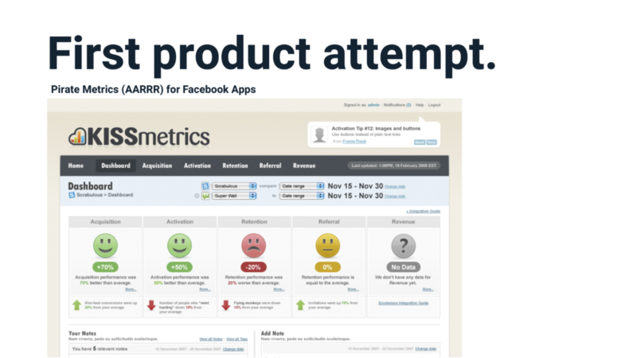

在为无法支付费用的客户开发了一款产品之后，我们决定将目标锁定于在线业务。

我们的第二个尝试是商业智能工具，提供给各种类型和规模的公司，让他们能针对自己的关键指标创建仪表板，让用户能跟踪任何想要的东西，以及自定义数据的查看方式。

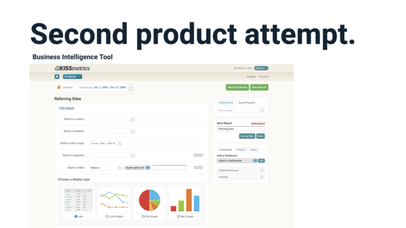

我们推出第二个版本时，用户认为产品需要定制化的东西太多，他们没兴趣花那么多的时间去配置这个产品。我们了解到，他们希望用尽可能少的工作量来获得价值。我们的业务需要对用户进行大量的咨询和服务，才能使第二版产品赢得市场。

尽管尝试着开发了两种不同的产品，我们仍无法吸引到用户。用户不关心或不想要我们开发的东西，团队感到很难过，我和我的联合创始人也走到了最后。我们觉得我们全都做错了。

我们被迫去评估自己的产品开发方法。

在做其他事情之前，先反思一下我们的错误：

* 应该花更多的时间来弄清楚现有解决方案存在的问题，以及具体哪些人存在这些问题；
* 目标客户需要愿意为解决方案付费；
* 没有尽可能多地了解市场和客户。我们做了有根据的猜测，但没有经过充分研究去做正确判断。这导致我们两次走错了路。

我们不得不向后退一步。

立即停止开发我们“以为”市场想要的东西，回到最基本的问题上来。我们停下敲代码的手，走出去和客户交谈。我们采访了使用 Google Analytics 的人，这款产品是我们最大的竞争对手。我们向他们提出问题，以便更好地了解他们的需求以及他们使用分析软件时遇到的问题。他们有很多话要说，于是我们就耐心地聆听着。

我们所做的第一件事，就是调查使用 Google Analytics 的人。

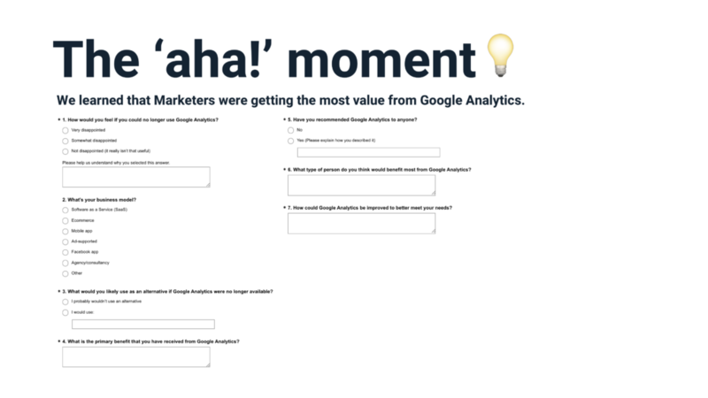

我们了解到，在线营销人员从 Google Analytics 中获得了最大的价值，我们很快就意识到应该将其作为目标。一旦人们访问他们的网站，就需要数据来帮助提高营销活动的绩效。他们也愿意支付分析费用，来帮助提高网站的转换率。

**在那一刻，我们的每件事都做得很好。** **是的，每件事。**

我们发现了人们所面临的亟待解决的问题，并将重点放在了利润丰厚的在线营销领域，创建了一个能解决他们问题的产品。

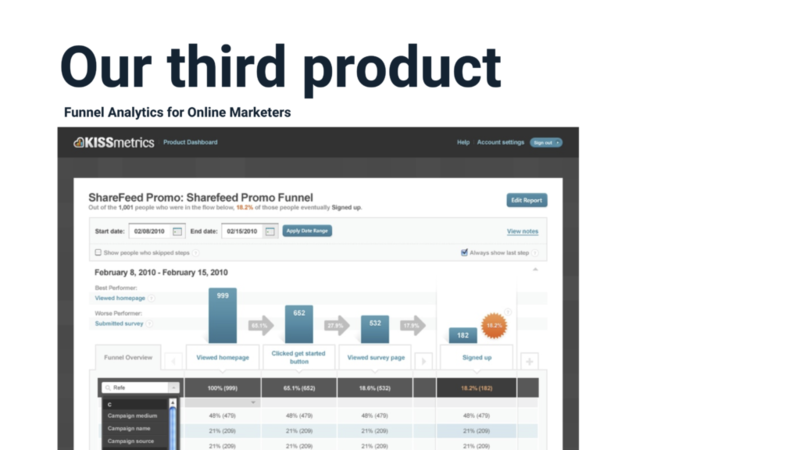

不仅如此，我们还在以闪电般的速度继续开发所有合适的东西，找到并明确了每个客户的需求。

以漏斗报告为例，在 KISSmetrics 之前，人们花了太多时间来创建和理解漏斗报告。我们的漏斗报告最后成为许多分析工具复制的行业标准。

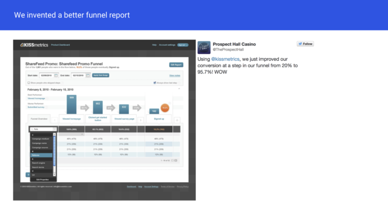

利用分析工具来实现和调试对新数据的跟踪可能需要几周的时间，这就是为什么我们构建了一个名为“KISSmetrics Live”的调试器，为开发人员实时显示传送到工具中的实际数据。

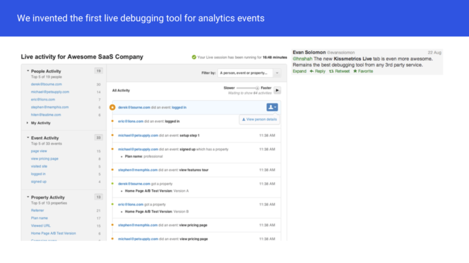

将用户级别的数据传送到分析工具是不可能的，你无法看到数据背后的用户是谁。因此，我们发明了一种新的分析数据模型，KISSmetrics 中的每一条数据都与一个身份相关联，要么是一个匿名 cookie，要么是一个电子邮件地址。

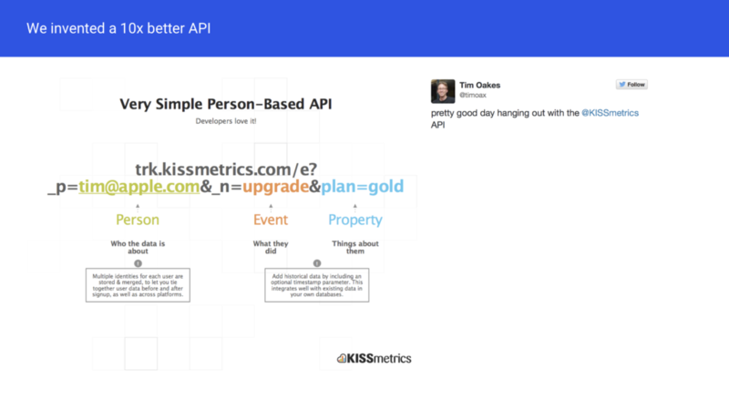

我们知道我们成功了，因为客户不停地在公开宣扬我们的产品有多么有用，例如，在推特上。我们牢牢地抓住了人们的每个痛点，他们也愿意告诉朋友这一点。那时我们仍处于初期访问的模式，每周都会收到数百个新的注册。

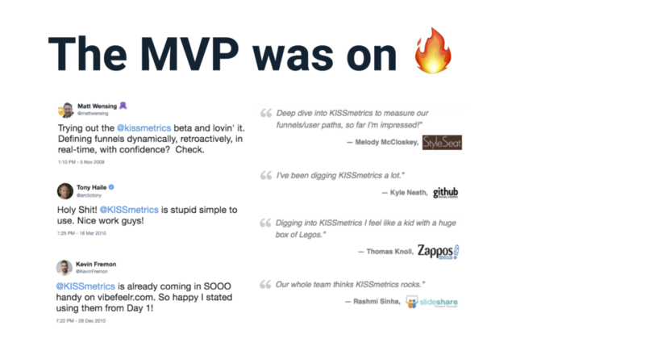

我们领先了市场整整 3 年。2010 年，我们将我们在整个分析领域的领先地位大幅提升，令竞争对手直到 2013 年才能缩小其间的差距。

毫无疑问，我相信我们本来已经将 KISSmetrics 变成了一家价值 10 亿美元的创业公司。但是，最后我们却输了。这正是我们自己干的，我们失去了它。

> _这次失败是我一个人造成的。我真的搞砸了。在重要时刻。_

所有的一切都历历在目，我的团队应该嘲笑我，他们应该好好开我的玩笑。说真的，就应该如此。

**因为，** **这都是我的错。**

### Hiten 炸弹

每天，我会给公司里的某个人丢个炸弹。它可能是一个新的想法、一个新的方向、一个我想出的走向辉煌的新东西，我们现在必须做的事。

* 我认为一个新功能可以帮助我们成长。（但事实上，不会）
* 竞争对手所激发的想法。（事实上并不会改变游戏规则的功能）
* 我从投资者、顾问或朋友那里听到的东西。（当时看起来很酷，我发誓 ……但同样，毫无价值）
* 最好的，也不过是前一天从一位重要客户那里得到的一个想法。

这种状态持续了几个月。结果太糟了，笑话都传到了我耳边，整个公司都开始叫它们 Hiten 炸弹。我在大厅里听到过，在路过员工的办公桌时也听到过。

我当时并没有意识到这一点，但对于我的团队来说，这种接二连三的胡思乱想简直就是乱弹琴。

无论好坏，我的想法都没有基于任何框架或过过脑子。 **我 ** **那**** 是 ** **在瞎指挥**** ， ** **却**** 以为 ** **是**** 在帮助 ** **大家**** 集中精力执行任务**。

**我完全错了。**

> _每当我扔“Hiten 炸弹”时，事情就会搞砸。_

团队会匆忙地执行我的想法，无论我想做什么，都成了当务之急。他们会聚在一起，找出最好和最快的方法来完成我提到的事情。他们会吸引更多的队友，并将其添加到不断增长的任务列表中，包括要开发的竞争性功能、要修复的错误和客户需求。

这些非常混乱且具破坏性的“Hiten 炸弹”投出去并没有实际解决问题，更糟糕的是，在这之后团队不再听我说话了。最终，他们对作为一名领导者的我失去了信心，甚至对公司的整体战略也失去了信心。

我树立了一个不好的榜样，却希望团队能取得优异的成绩。我希望他们做客户调查，挖掘我们的数据，并使用所有这些信息来构建真正重要的特性。

结果相反，我让情况变得更糟，而不是更好。

首先，我的团队开始以微妙的方式来应对：
“Hiten 还会有另外一个“ **伟大的** ”将会拯救公司的想法。”
“我要等他给我三次回信，然后再做任何事情。”
“我刚刚又收到一枚 Hiten 炸弹，我忽略了它。”

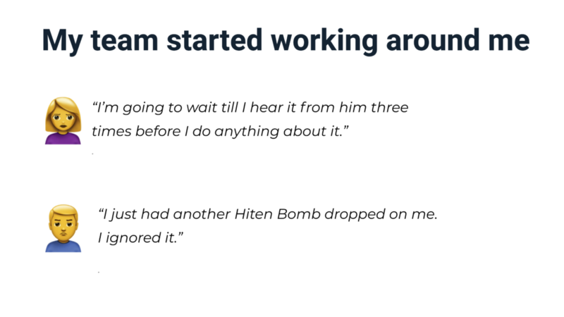

然后发生了一件事情，产品主管给整个公司写了一份内部备忘录，在备忘录中他详细描述了一枚 Hiten 炸弹是什么以及它是如何影响团队的。
_“希望我能帮助每个人了解那些看起来离奇古怪的东西是从哪里来的。”_

大家不得不为我的行为找借口并原谅我。但事实上，我所做的错事没有借口。

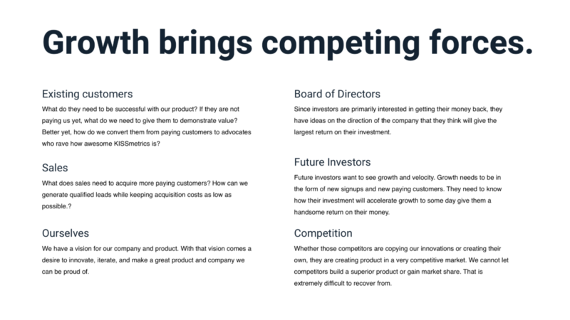

备忘录被发给团队后，我停了下来。如果团队中有人不得不写一份 1300 字的备忘录来说明我的管理风格，我就是问题所在，而不是他们。

**我拖了公司的后腿。**

这就是我需要改变的。团队的成员日复一日地感受到挫折，无数的时间浪费在无关紧要的事情上，竞争对手走到了前面，客户因此离开我们。

> _我们有所有正确的投入，我们有正确的意图。我们缺少的是一个流程来选择优先要做什么和为什么这么做。_

我们各自为战，团队中的每个人都在做他们认为正确的事，但不知道到底什么对业务最有利。

我自己不知道该做什么，也不知道应该注意哪些。几个月后，因为备忘录事件，我发现这也正是团队的感受。

**我把事情搞得更糟了。**

这不是一个伟大的领导者该做的。伟大的领导者不会分散团队的注意力，伟大的领导者不会让人觉得每天都像有一场新的消防演习，伟大的领导者不会发送混乱的信息表示需要做什么。

他们不会像我一样不断地在团队中投放“Hiten 炸弹”。

> _伟大的领导者始终如一，他们提供指导，让团队始终专注于做对业务最好的事情。_

他们是公正的，专注于执行，制订一个愿景，协助安排优先次序，使团队保持一致。这也是伟大的产品经理每天所做的。

这就是作为一个产品领导者或经理每天要做的，没有其他重要的事情。

你的工作是过滤每天收到的所有信息，消除所有的干扰。决定将有限资源集中在哪里，为业务确定正确的活动，所有人都保持一致，所以只有最重要的优先事项才能得到执行。

如果不这样做会怎样？

最起码，你会失去团队的信心。他们每天都会尽早离开，开始在每件产品上拖更长的时间。他们不会像原来那样信任你。你那些太多徒劳无果的事，或太多的管理驱动将令他们倍受“煎熬”。

最坏的情况是，你会阻碍产品的发展势头，让竞争对手迅速成长超过你。相信我，这会发生的。尽管我们比竞争对手在整个项目上领先 3 年，但对于 KISSmetrics 而言，竞争对手仍然缩小了与我们之间的差距。

### 竞争对手如何接近我们的领先优势并超越我们

因为被 Hiten 炸弹分散了注意力，我们低估了竞争对手的影响力。竞争对手开始成功地蚕食市场。它们的效率比我们更高，原先我们所做的都是对的，它们复制了我们所做的每一件事。然后他们针对我们错过的不同新兴客户，进行了渐进式的改进。

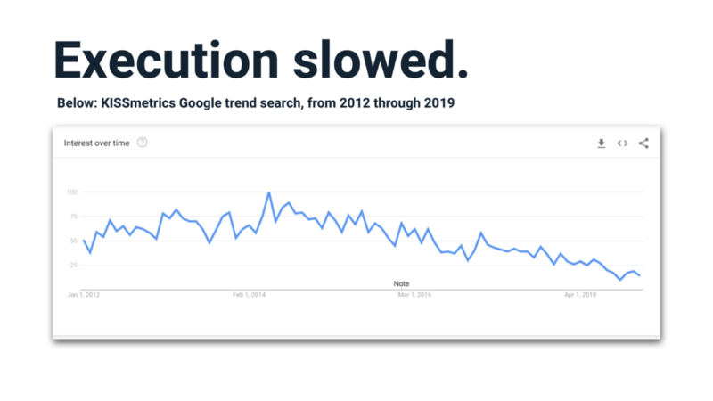

我们的产品以网络为中心，他们很快就聚焦在移动 app 上。即使到了今天，KISSmetrics 仍然不能很好地应用于移动 app。MixPanel 本是跟在我们其后的其中一名竞争对手，但更敏捷、更快速的他们击败了我们。他们早在我们之前就开始关注移动 app 了。

这种焦点转移帮助他们筹集到了 7700 万美元的资金。相比之下，我们在 KISSmetrics 上筹集到的资金不足 2500 万美元。

Mixpanel 还有一个免费的计划（KISSmetrics 没有），即通过在网站上安装一个徽章，客户可以免费跟踪更多的数据。

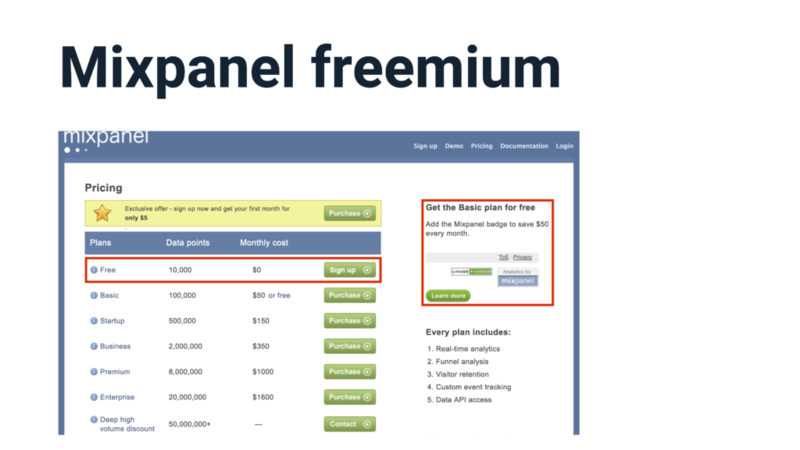

我们对他们的策略置之不理，因为我们认为这样做会很昂贵。我们假设客户支持和基础设施的成本太高，无法提供类似的服务。其实当到处都看到站点徽章时，就应该复制 Mixpanel 的策略。

我们率先在分析领域创建了实时跟踪调试器，它旨在帮助人们实现和调试他们的数据。但我们错过了一件重要的事情：赏心悦目。

实时的视图在打开时看起来非常酷，还可以进行观察。Mixpanel 意识到了这个功能能帮助他们达成交易，在销售演示中比我们宣传的多很多。他们还对它进行了改进，比我们的看起来更养眼。我们忽视了他们所做的努力，没有考虑背后的“原因”，损失了大量的销售额。

一个名叫 Heap 的新竞争者甚至比 Mixpanel 更晚进入这个领域。他们有一个非常强大的价值主张，以一个简单的 API 来实现分析跟踪。让人们能够一次性安装一个跟踪脚本，即能够自动跟踪在网站上所做的每一件事。

当 Heap 刚起步的时候，我们可以很容易地复制这个特性并破坏他们的势头，但我们没有。他们现在有超过 6000 个客户，总共筹集了 4000 万美元。

我们太过忽视竞争对手了，我们的执行力糟透了，它们令我们受到了极大的伤害，上面的例子只是其中几例罢了。

实际上，我们非常擅长提出正确的想法，但没有快速地执行（和迭代）这些想法，却看着其他人后提出这些想法并能更快地执行。我们傲慢地拒绝了市场迫切需要的想法，为竞争对手留下了广阔的机会。

> _我们错过了这么多让客户更爱我们的机会。_

我们忽视了竞争对手，没有从他们的行动中进行学习来推演我们的市场假设。我们没有利用准确数据的优势来考虑我们的产品开发。我们漏掉了关键的信息，因为我们完全忽视了竞争对手，没有好好关注他们以更好地了解我们的客户。

### 根本原因

首先，KISSmetrics 的第一年里我们在挣扎。我们不断尝试不同的想法，却没有任何效果。

然后，出于绝望，我们尝试了一种完全不同的产品方法。于是发现了最大的机会，去倾听了市场。在这一点上并没有一个可靠的过程，只是知道必须做一些不同的事情。我们其实偶然发现了一个构建真正成功产品的过程。

两年后，我们打造了一个非常热门的 MVP，却无法持续追踪所有的口碑以及 Twitter 上快乐的反响。

然后开始滑倒。

在业务开展几年后，执行速度放慢了。

不再创新，也不再保持领先。我们培养了这支队伍，但放慢了速度。竞争对手赶超我们只是时间问题，最终，他们确实走到了前面。

他们将复制你拥有的东西，并将超越你。如果他们的团队擅长复制，创新能力可能不会那么好。但是他们所做的任何改进，即使只是你发明的一件小东西，也会帮助他们走到前面。他们只需要比你更快一点，更高一点。

> _速度真的很重要。_

不能只抓住市场一次就指望能保住它。如果想与落后的竞争对手保持距离，必须一次又一次地、比其他人更快地做到这一点。这就是抢占市场的方式。

最后，我们失去了那种魔力。我们忘记了帮助我们交付最初令人惊叹的产品的过程。我们又回到了旧的坏习惯。我们在产品方面的进展停滞了 3 年，这足以让整个行业的其他人迎头赶上，然后再创新。

这一切都是因为忽视了最初是如何取得成功的。

在最初的成功之后，由于没有做正确的事情，我们失去了 10 亿美元的机会。

> _不要犯同样的错误。_

在创建产品时，很容易出现胡乱指挥或一拍即合就干起来的情况。我已经了解到，推动产品增长的关键，是创建一个流程，能够产出可重复取得成功的产品。不是一次成功，也不是两次成功，而是在几个月、几年甚至几十年中不断地取得成功。

成功的产品流程依赖于不断地创新，以专注和计划为基础，保持无偏见的研究和以目标为中心的发展。想以正确的方式构建产品需要冲在前线工作，但只要是投入进去，每次坐下来看看度量指标时，你会得到回报的。

**查看原文链接** ：[My Billion Dollar Mistake](https://producthabits.com/my-billion-dollar-mistake/)
