## 如何从零开始搭建 CI/CD 流水线  

> 作者: Saurabh Kulshrestha  
> 译者: 徐进  
> 发布日期: 2019 年 4 月 9 日  

在当前 DevOps 的趋势下，持续集成（CI）和持续部署（CD）具有支柱性地位，那么能够成功搭建 CI/CD 流水线就至关重要了。我们可能会在各种角色的岗位描述中发现关于「持续集成」和「持续部署」技能的要求，比如：数据工程师、云解决方案架构师、数据科学家等。为了在开发团队和运营团队之间搭建桥梁，CI/CD 流水线实现了应用程序的自动构建、自动测试和自动部署。本文中，我们将介绍什么是 CI/CD 流水线，以及它是如何工作的。

在介绍 CI/CD 流水线的工作原理之前，我们先了解一下什么是 DevOps。

### 什么是 DevOps？

DevOps 是一种软件开发方法。它将持续开发、持续测试、持续集成、持续部署和持续监控贯穿于软件开发的整个生命周期。当前几乎所有的顶尖公司均采用了该方法，用以提高软件开发质量，并缩短软件开发生命周期。从而以达到每个公司对软件产品的期望，交付出客户最满意的产品。

### DevOps 生命周期

要想完整的理解 DevOps，我们还需要了解一下 DevOps 的生命周期。接下来，我将通过一张图来展示 DevOps 的生命周期以及它和软件开发生命周期之间的关系。

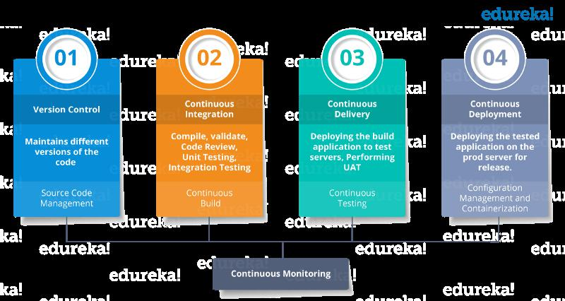

### 什么是 CI/CD 流水线？

CI 代表持续集成（Continuous Integration），CD 代表持续交付（Continuous Delivery）和持续部署（Continuous Deployment）。也可以将它们看作是类似于软件开发生命周期的过程。

现在我们来看一下它是如何工作的。

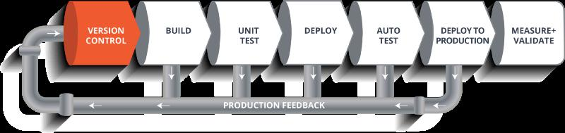

如上图所示，该流水线展示了一个软件在其最终交付给客户或者投入上线之前，它在其生命周期内各个阶段中的移动过程。

接下来我们具体看一下该 CI/CD 流水线。假如我们要构建一款 Web 应用程序，并将它部署在一个现场 Web 服务器上。同时我们有一组开发人员，他们主要负责编写代码，并将代码构建为 Web 应用程序。假设现在开发团队已经将代码提交到版本控制系统（如：Git，SVN）中了。

### 构建阶段

接下来，代码将会经历构建阶段，这也是 CI/CD 流水线的第一阶段。在此之前，开发者已经将他们的代码加上合适的标签，并提交到版本控制系统中了。

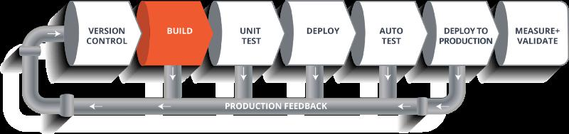

假如我们采用的是 Java 语言，那么还需要先进行代码编译。因此，代码在通过版本控制阶段之后，会先在构建阶段予以编译。该阶段会从代码库的各个分支中获取到所有的功能代码，合并后最终通过一个编译器来编译它们。这整个过程都被称为「构建阶段」。

### 测试阶段

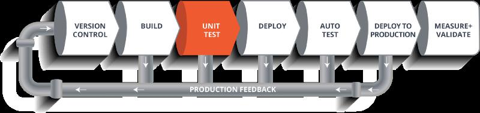

构建阶段结束后，将会继续进入到代码的「测试阶段」。在这个阶段中，我们会进行各种各样的测试，单元测试就是其中之一。在该阶段中，我们会测试代码中多个组件间的关系或者单个组件的功能，同时也会进行软件的可用性测试。

### 部署阶段

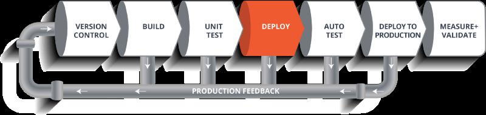

测试阶段完成后，就要进入「部署阶段」了。在该阶段，代码将会被部署到准生产环境服务器（staging server）或者测试环境服务器（test server）中。同时在该阶段中，我们既可以查看程序代码，也可以在模拟器中运行该应用程序。

### 自动测试阶段

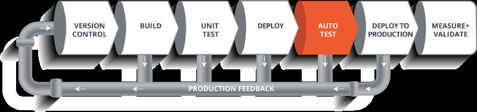

只要我们的代码部署成功，我们就可以运行另一组可用性测试了。该阶段结束后，如果所有的测试都通过了，那么就可以将其部署到生产环境中了。

### 部署到生产环境

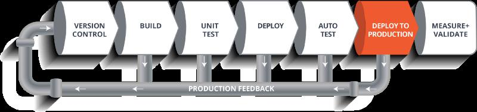

另外值得一提的是我们可能在每一个阶段的执行过程中遇到一些错误。在这种情况下，我们可以将错误邮件发回到开发团队中，以便他们能够及时修复这些错误。当开发团队修复完成后，就可以将代码重新提交到版本控制系统中，然后再次从头开始执行该流水线。

如果在执行测试的过程中遇到了任何错误，那么这些错误也将反馈给开发团队，等他们修复完成后，同样会再次触发该流水线，进行新一轮的持续迭代。

### 度量和验证阶段

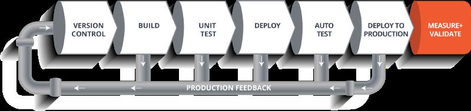

因此，整个生命周期将会继续迭代下去，直到我们得到可以直接部署到生产环境中的代码或者产品。除此之外，在生产环境中我们还需要对代码进行度量和验证，以实时监控应用的线上运行状态。

到目前为止，我们已经了解了 CI/CD 流水线及其工作原理，接下来我们将继续介绍什么是 Jenkins ，以及如何使用 Jenkins 部署示例代码，并自动化整个过程。

### 终极 CI 工具 - Jenkins

我们的目标是要将软件开发生命周期的整个过程都自动化，从开发人员向代码库中提交代码开始，到将此代码投入生产环境中使用为止。

为了使整个软件开发流程处于 DevOps 模式或自动化模式，我们就需要对 CI/CD 流水线进行自动化。因此，我们还需要一款自动化工具来做这件事情，它就是 Jenkins。

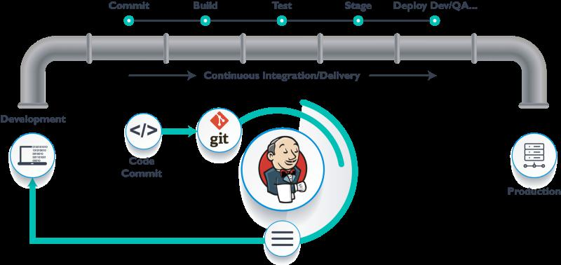

Jenkins 为我们提供了各种接口和工具，用以实现软件开发整个过程的自动化。

首先，我们需要拥有一个可以供开发人员提交代码的仓库。同时，Jenkins 也提供了前端展示的页面，我们可以使用该前端页面来定义整个流水线的作业（job）和任务（task）。对于某一个应用程序而言，我们的目标就是通过特定的工具实现其持续集成和持续交付的自动化流程。

Jenkins 会从 Git 代码仓库中拉取各个分支的代码，然后将其移动到 “代码提交阶段”。拉取到各个分支的代码之后，Jenkins 就会将其继续移动到“构建阶段”，该阶段会对代码进行编译工作。如果是像 Java 这类语言的话，我们还可以在 Jenkins 中选用 maven 之类的构建工具，通过 maven 对代码进行编译。之后在部署过程中，还可以将编译好的代码进行一系列的测试，同时这些测试也会由 Jenkins 监督执行。

之后，Jenkins 就会将代码移动到准生产环境，并使用 Docker 进行部署。在准生产环境中会运行一系列单元测试和可用性测试。如果能够通过所有的测试，Jenkins 就会将它继续移动到生产环境中。

这就是 Jenkins 在持续集成和持续交付中所发挥的作用，它几乎能够自动化所有的事情。现在，我们还需要一个和生产环境一致的环境用以部署代码，它就是 Docker。

### Docker

Docker 就像是一个虚拟的环境，我们可以在其中创建一个服务器。我们可能需要花费一点时间在 Docker 中部署整个服务器以及我们想要测试的工件。那么，这里我们遇到的问题就是：

我们为什么要使用 Docker 呢？

如前所述，通过 Docker 我们可以在几秒钟的时间内运行整个服务器集群。同时我们还有 Docker 镜像的注册中心，可以用来永久地存储构建出的 Docker 镜像。因此，我们在任何时候都能复制出一份 Docker 镜像并运行它。

### Docker 和 Jenkins 构建 CI/CD 流水线

第 1 步：在虚拟机中打开终端。通过命令 “systemctl Start Jenkins”、“systemctl enable Jenkins” 和 “systemctl Start Docker” 来启动 Jenkins 和 Docker。

> 注意：如果提示 “privileges error” 错误的话，就在命令前面加上 sudo。

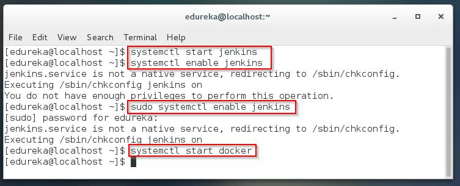

第 2 步：在浏览器中打开在指定端口运行的 Jenkins。通过点击 “New Item” 来创建一个 Job。

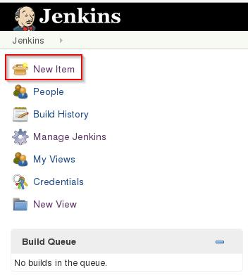

第 3 步：选择 “freestyle project” 并填写项目的名称（如下以 “Job1” 为例），并点击 OK 确认。

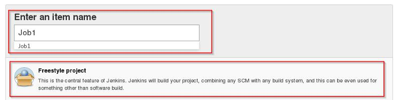

第 4 步：选择 “Source Code Management”（源代码管理），并提供一个 Git 仓库地址。然后再点击 “Apply” 和 “Save” 按钮确认。

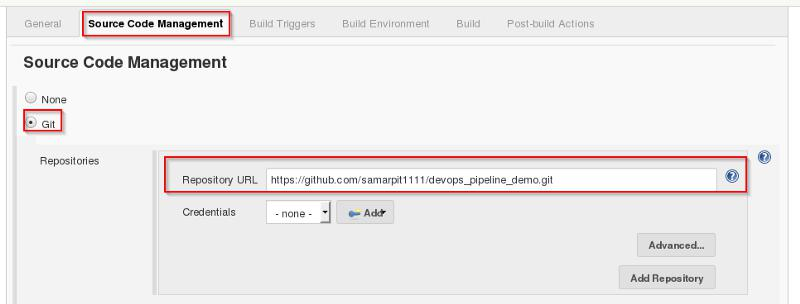

第 5 步：点击 “Build” 选项，并在下面的菜单中选择 “Select Execute Shell”。

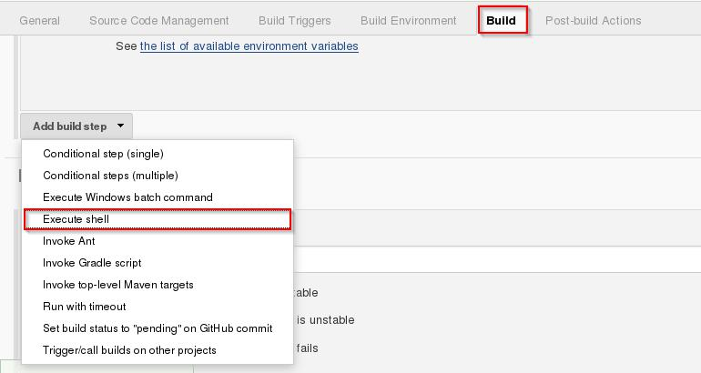

第 6 步：输入 shell 命令。如下示例脚本会构建已归档的文件，并得到 war 格式的文件。在此之后，它将会拉取最新的代码，然后，采用 maven 安装所依赖的包。因此，在这个步骤中只是简单的安装了依赖并对应用程序进行了编译。

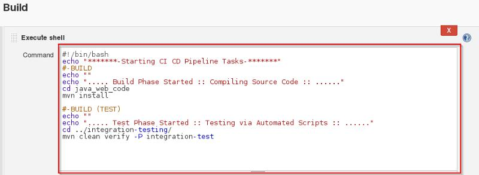

第 7 步：通过点击 “New Item” 来创建一个新的 Job。

第 8 步：选择 “freestyle project” 并填写项目的名称（如下以 “Job2” 为例），并点击 OK 确认。

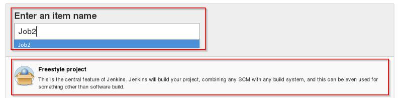

第 9 步：选择 “Source Code Management”（源代码管理），并提供一个 Git 仓库地址。然后再点击 “Apply” 和 “Save” 按钮确认。

第 10 步：点击 “Build” 选项，并在下面的菜单中选择 “Select Execute Shell”。

第 11 步：输入 shell 命令。如下示例脚本将会开始代码的集成阶段，并构建出 Docker 容器。

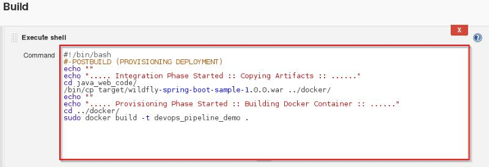

第 12 步：通过点击 “New Item” 来创建一个新的 Job。

第 13 步：选择 “freestyle project” 并填写项目的名称（如下以 “Job3“ 为例），并点击 OK 确认。

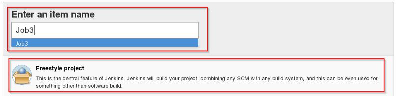

第 14 步：选择 “Source Code Management”（源代码管理），并提供一个 Git 仓库地址。然后再点击 “Apply” 和 “Save” 按钮确认。

第 15 步：点击 “Build” 选项，并在下面的菜单中选择 “Select Execute Shell”。

第 16 步：输入 shell 命令。如下示例将会检查 Docker 容器文件，并将它部署在 8180 端口上。点击 Save 按钮保存。

第 17 步：点击选择 Job1 ，进入 Job1 后再选择 Configure 选项。

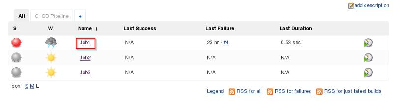

第 18 步：点击 Post-build Actions 选项，并在下面的菜单中选择 Build other projects。

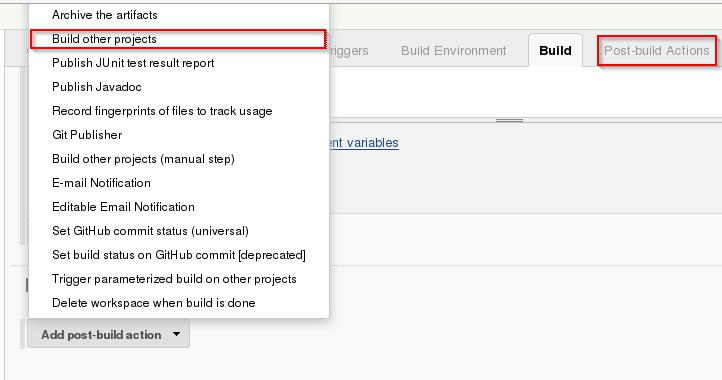

第 19 步：填写在 Job1 构建完成后需要执行的任务（如下示例中为 Job2），并点击 Save 按钮保存。

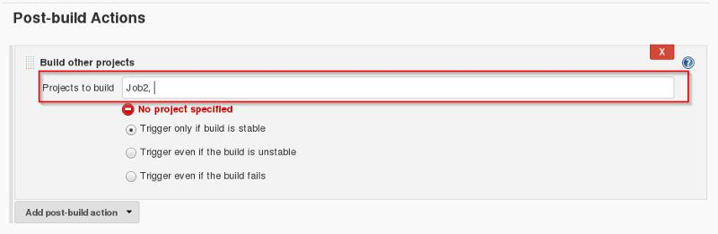

第 20 步：点击选择 Job2，进入 Job2 后再选择 Configure 选项。

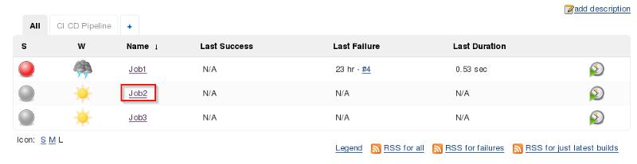
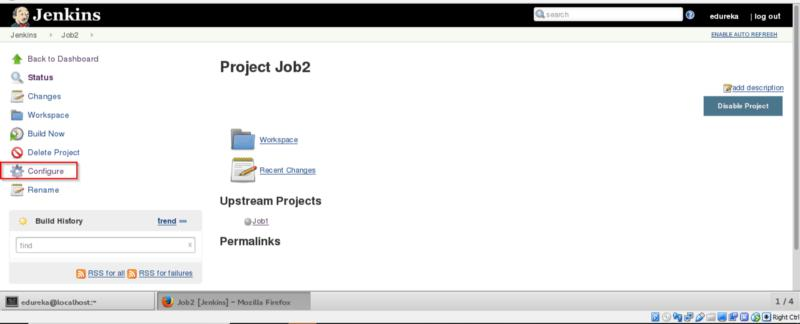

第 21 步：点击 Post-build Actions 选项，并在下面的菜单中选择 Build other projects。

第 22 步：填写在 Job2 构建完成后需要执行的任务（如下示例中为 Job3），并点击 Save 按钮保存。

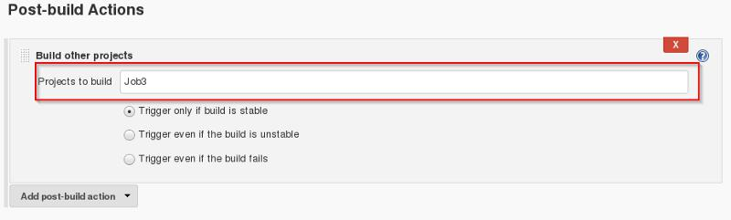

第 23 步：接下来我们将通过点击 “+” 号创建一个流水线视图。

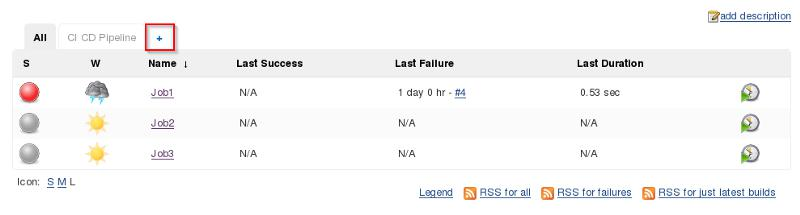

第 24 步：选择 “Build Pipeline View” 并填写视图的名称（如下以 CI CD Pipeline 为例）。

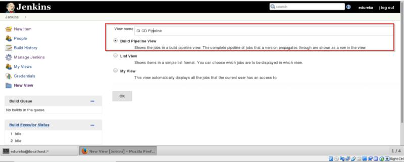

第 25 步：选择 “Initial Job”（如下以 Job1 为例），并点击 OK 按钮确认。

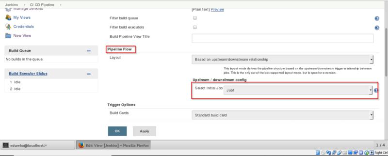

第 26 步：点击 Run 按钮来启动 CI/CD 流水线的流程。

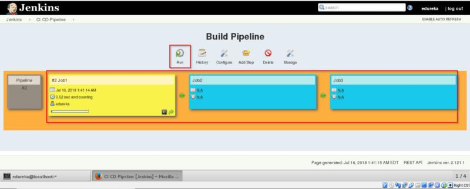

第 27 步：在流水线成功运行完成之后，我们可以在浏览器中打开 localhost:8180/sample.text 进行验证。此时该应用程序已处于运行状态，并且浏览器中会显示出此文本文件的具体内容。

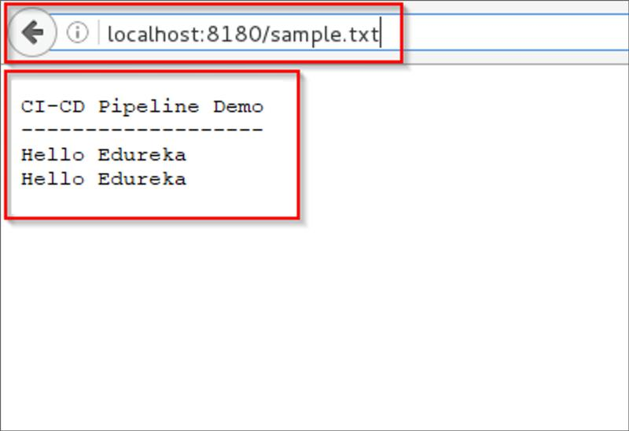

到目前为止，我们已经学习了如何使用 Docker 和 Jenkins 来创建 CI/CD 流水线。之所以要采用 DevOps 模式，目的就是为了可以更快速更可靠的构建出高质量的软件，同时还能够加深团队之间的沟通和协作。

英文原文：<https://medium.com/edureka/ci-cd-pipeline-5508227b19ca>
