## 上海久耶基于HBase实时数仓探索实践  

> 作者: DataFun社区  
> 发布日期: 2019 年 4 月 6 日  

> 本文根据上海久耶大数据研发工程师武基鹏在中国 HBase 技术社区第四届 MeetUp 上海站中分享的《基于 HBase 实时数仓探索实践》编辑整理而成。

文章从六个方面介绍，首先是久耶第一代离线数仓以及第二代实时数仓。接下来介绍下公司业务场景和业务开发，基于 HBase 的开发流程，然后公司 CDH 集群调优监控，最后分享两个生产案例。

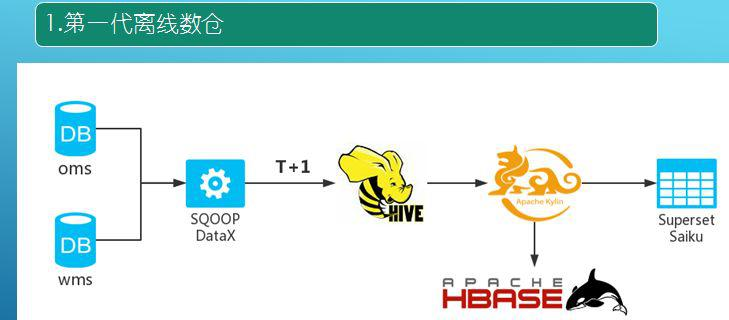

第一代离线数仓是在去年三月份上线，主要是基于 OMS 和 WMS，由于分库分表，大约有十几个库。前期通过 SQOOP 进行数据抽取，后来由于 SQOOP 的一些问题采用了阿里开源的 DataX，时间粒度使用脚本调度实现， T+1 模式抽取到 Hive。分析时采用 Apache 的 Kylin，将各个指标计算结果数据直接存入 HBase 中，最初数仓的是用于各个部门业务指标的 Dashboard，用的是 Superset\(只能定制化\)，后面也用了 Saiku\(支持上钻下钻，动态需求指标更多\)。离线数仓六个月就被淘汰了，因为离线数仓有个问题，业务部分要查询数据指标，但是时间粒度是昨天的，业务部分需要看当天一段时间内的数据，离线是无法满足。

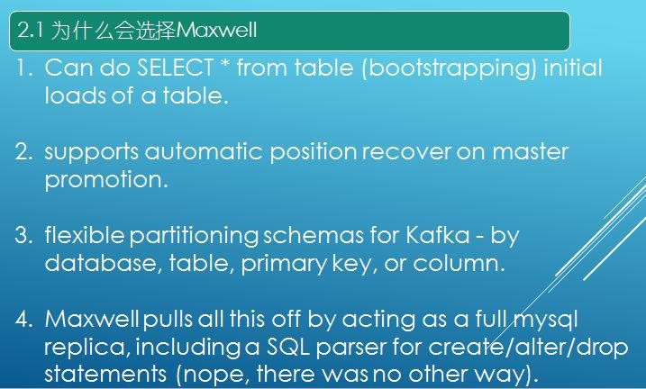

接下来在另一个集群构建实时数仓，其选型主要有两个，第一个是实时，实时采集利用 Maxwell，直接采集公司数据库 MySQL，将数据直接以 json 格式发送到 Kafka 集群，数仓存储选型是 HBase。

为什么选择 Maxwell 呢？

1. 它能够使用“select \* from Table”进行 bootstrapping 初始化数据，在大数据构建时可以利用 Maxwell 进行全表扫描，这句 SQL 会自动触发 Maxwell 某个线程进行数据拉取，将表的历史数据全部刷新过去。

2. Maxwell 支持断点还原功能，大数据平台架构不光考虑到高可靠、高性能，也要保证数据零丢失，它支持 MySQL 的 binlog 文件的 pos 点记录进行数据还原，这是当初选择最重要的原因。

3. Maxwell 将数据从 MySQL 发送到 Kafka，Kafka 是分区的，如何保证全局有序是个问题。
它能保证这个特性，参数支持 database, table, primary key, or column 选择，
将数据按照参数选择发送到某个分区。
比如一条业务数据在业务系统先做 insert 再做 update 再做 delete 记录，Kafka 会将这三条 binlog 数据发送到三个分区，key 值为空，在使用 SparkStreaming 消费时可能会以 delete、update、insert 顺序，会造成数据紊乱。我们希望将这些特征数据发送到 Kafka 一个分区，而 Kafka 每个分区本身就是支持有序的。生产上，我们选择 primary key。

4. 当业务数据的表结构需要升级，如加索引、加字段，可以通过 Maxwell 捕获到 alert 语句进行解析，同步更新到 Phoenix 表 \(HBase\) 中。

基于这四点主要特性需求，选择了 Maxwell，没有选择当前其他开源产品。

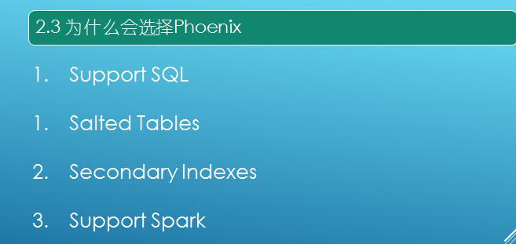

接下来讲一下为什么选择 HBase 而不选择其他大数据组件？

1. HBase 是分布式、可缩的；
2. 随机的读和写；
3. HBase 支持百万列。

更多的好处就不过多复述。

第三个介绍下为什么要选择 Phoenix 呢？

1. HBase 进行 put 数据，scan 查询、代码开发比较吃力，不优雅，而 Phoenix 是支持 SQL。
2. 我们构建的表是盐表，能够解决热点问题，避免一个节点很繁忙另一个节点很闲。
3. Phoenix 支持二级索引，由于表是盐表（分区），索引也是分区的。
4. 支持 Spark，有效的 ETL 敏捷开发。
基于这四点主要特性需求，选择了 Phoenix，而不用专注于底层 HBase，当成黑盒。\(当然底层的 Linux、HDFS、HBase 也需要调优，稳定\)

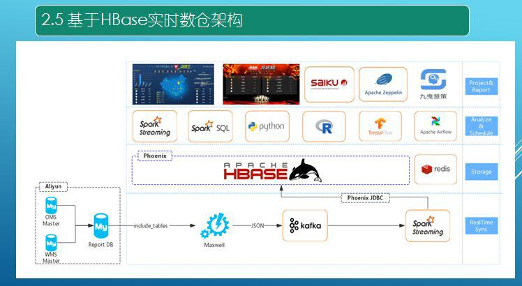

上图是实时数仓架构图，主要的存储层还是以 HBase 为主。第一层业务系统数据库在阿里云平台上，有 OMS、WMSReport DB 是 OMS 和 WMS 的合并从库。使用 Maxwell，其支持白名单和黑名单。业务平台的表可能有两三百个，大数据平台的计算可能只需要 100 多个，可以添加白名单，有些表的数据就可以不用过来了。这些数据通过 Json 发送到 Kafka，然后通过 Spark Streaming 去消费 Kafka，通过 JDBC 写入 HBase。\(性能不低，现在我们生产上有反压机制控制，3S 一个批次可以写最大 6W 数据，批次不堆积，不会有雪崩效应。要考虑数据获取，处理，写出去，所以 3S 是一个经典经验值。\)

表是通过 Phoenix SQL 语句创建，我们真正不关心底层 HBase。就像操作 MySQL 一样即可。同时会将计算结果存储到 Redis\(双十一实时大屏\)，也会将数据写入 ES 里面 \(久耶慧策 IDSS，钉钉应用\)。中间一层就是业务开发，如 SparkStreaming、SparkSQl\(现在也有 Flink\)，也用 Python 和 R 去分析挖掘。调度平台起先用的是 Azkaban，然后 Airflow，最后用的是 Rundeck\(易用稳定主要选择\)。上图蓝色是实时大屏，红色是全球仓库指标，大约有四十几个仓库。运营人员是直接 Saiku，将 Phoenix jar 包集成进去，Saiku 支持上钻下钻，运营人员依据自己的需求去拿行和列数据，Saiku 通过 Phoenix 组装 SQL 语句查询结果数据。也用到 zeppelin，这是 Spark 交互式开发必须用到的。

接下来讲一下数据仓库，首先是模型建设，第一层是基础表，在 Phoenix 中建立与 MySQL 一样的表。在基础表的基础上构建事实表（订单事实发生的表）和维度表（如中国有多少省多少市等更新不是很大的表），依据事实表和维度表进行代开发，构建领域表，就是依据业务需求得出的结果存到领域表。数据校验是通过数据量比对，起先是在从库时做触发器，但是 MySQL 从库触发器不支持生效。通过改造 Phoenix 代码将数据写入 Redis，增加加一删除减一，MySQL 数据和 HBase 数据是一天卡一天对比。当不相等直接调用 shell 脚本进行该表昨天整天数据刷新同步 \(性能很高\)，然后调脚本修复第二层第三层数据 \(凌晨调度，至关重要\)。当前只采用 OMS、WMS 的库，业务的 QPS 处于 2000，1 条数据: 平均 60 列，495b 字节。\(现在我们已经对接 13 条业务指标数据同步，到大数据平台\)

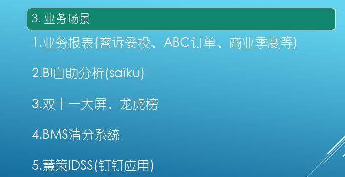

业务场景开始是业务报表开发，有客诉妥投、ABC 订单、商业季度等。也提供一个 BI 自助分析，第三个就是双十一大屏和龙虎榜，同时使用了 BMS 系统，是一个商业结算系统。第五个是今年做的领导层和客户层的慧策，商业决策分析。

业务开发套路就是依据业务需求将数据存在那些表里面，需要将构建表的语句提取出来构建 Phoenix Table，然后 Kafka+Spark Streaming+Phoenix 进行数据的插入。接着就是 Spark 开发读和写，我们还利用了 DBeaver。我们建表使用了联合组件，由于公司集群规模不是很高，regionServer 是 38 台，COMPRESSION 是使用 SNAPPY，这是依据压缩比、解压性能。

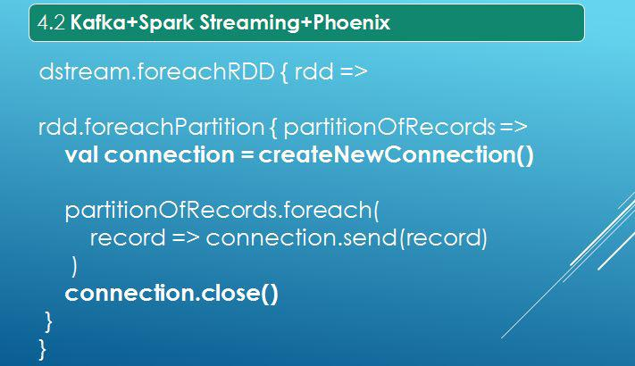

接下来是一个经典开发案例 Kafka+Spark Streaming+Phoenix，Phoenix 可以理解为 MySQL 架包的 JDBC。我们并没有使用 Phoenix 的 Pool 池，官方也推荐使用正常 JDBC 文件，因为 JDBC 已经支持长连接，Kafka 接收过来数据是 Json 格式，将其转化为 Phoenix 的 upsert 语法和 delete 语法，完成后就将连接关闭。（这个场景是做数据实时同步。当然也可以在 foreachPartition 进行常规数据 ETL 处理，这里不过多叙述）

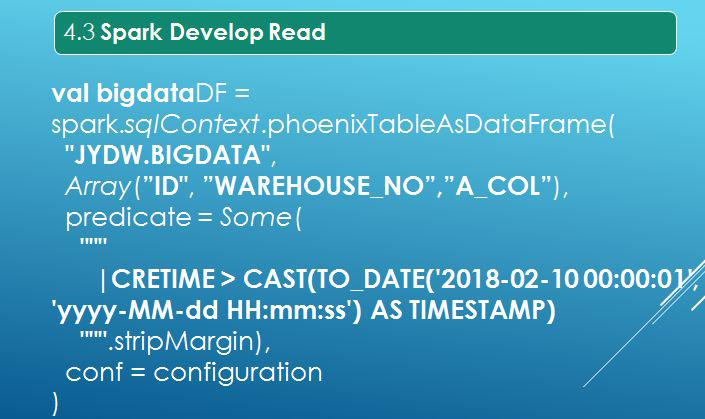

大数据平台是通过 bootstrapping 的全表扫描，其增量数据也是实时进入。业务代码开发首先将 client jar 包配置在 pom 文件。Phoenix+Spark 读取有好几种，选择以上写法原因有：首先其支持列裁剪，第二支持 where 条件，configuration 指的是 Spark 的 HDFS 的 conf。

业务开发是多张表，Spark+Phoenix 转成 df，接下来就和 Phoenix 和 HBase 无关。接下来就是对接 Spark 业务开发逻辑处理，最后结果集会回写到 HBase，还是通过 Phoenix 写入，使用 overwrite。HBase 没有很好地可视化工具，我们直接利用 DBeaver 工具，进行表及数据的各种建表、查询等操作来。

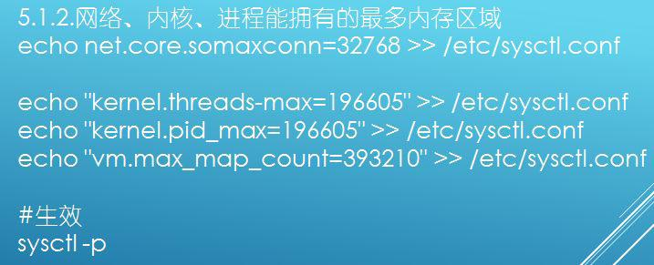

接下来介绍下集群调优参数，分为六个方面：（1）Linux parameters、（2）HDFS parameters、（3）HBase parameters、（4）GC parameters、（5）Monitor、（6）Bug。句柄数、文件数、线程数这些都是要调，因为 regionserver 在操作时需要 open file，处理时需要用到一些线程，一些系统都是架设在 Linux 上，因此集群调优都需要调它。需要注意的是改完后需要检查是否生效，立即生效是 sysctl -p 命令。Spark 开发需要将数据频繁的写入 HBase 中，HBase 底层是 HDFS，在写入时就会出现问题，最后发现 Linux 系统参数没有调。

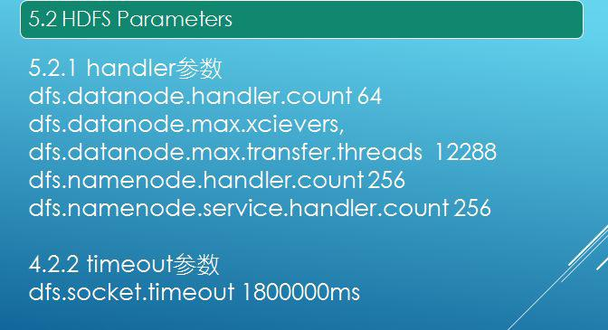

在正常的 HBase 节点机器上，swap 是设置为 0，这并不是禁用 swap 而是其惰性是最大的。由于我们公司由于业务系统较多，吃的内存比较紧，因此设为 10，这样可以使 job 慢一点但是不能挂，但是如果做实时就需要设置为 0。这个最终设置取决于你们自身业务环境，选择自己需要的就好。如果做 CBH 的平台部署必须要关闭大页面。

接下来分享一个有意思的参数 HDFS Parameters，正常调优是 CDH 界面打开、HBase 的配置参数 tab 页打开。主要调优是 timeout 和 handler 参数，将其几倍放大，socket.timeout 在 HBase 的 xml 文件一定要部署，否则无法支持高性能写操作。

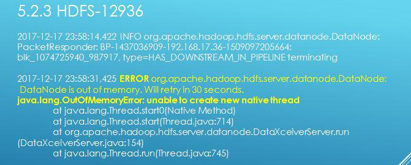

无法创建一个本地线程，抛出 oom 错误。
当时 datanode 的内存配置是 8G，实际只使用 1G，这个时候就要加上三个参数:

复制代码
[code]
<table>
<tr>
<td>

</td>
<td>

echo "kernel.threads-max=196605" >> /etc/sysctl.conf

</td></tr>
<tr>
<td>

</td>
<td>

echo "kernel.pid_max=196605" >> /etc/sysctl.conf

</td></tr>
<tr>
<td>

</td>
<td>

echo "vm.max_map_count=393210" >> /etc/sysctl.conf

</td></tr>
<tr>
<td>

</td>
<td>

sysctl -p

</td></tr>
<tr>
<td>

</td>
<td>

</td></tr>
<tr>
<td>

</td>
<td>

vi /etc/security/limits.conf

</td></tr>
<tr>
<td>

</td>
<td>

* soft nofile 196605

</td></tr>
<tr>
<td>

</td>
<td>

* hard nofile 196605

</td></tr>
<tr>
<td>

</td>
<td>

* soft nproc 196605

</td></tr>
<tr>
<td>

</td>
<td>

* hard nproc 196605

</td></tr></table>
[/code]

这其实是底层 Linux 抛出的错误。
提醒一点 socket.timeout 参数不仅在 HDFS 中需要配置，在 HBase 中也需要配置。

GC 参数调优是 regionserver 至关重要的配置，但是 CDH 配置，GC 默认垃圾选择器是 CMS，需要将其改为 G1，如果需要配置可以去尝试下，小米以前分享过。可以对参数进行调试进行压测调优，尤其大数据平台开发必不可少如此。

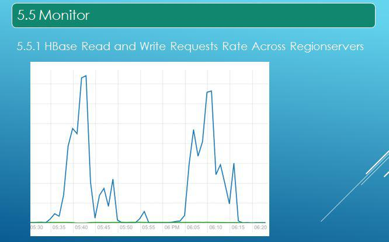

项目上线需要做监控，第一个就是 HBase 的读和写，绿色是写，但是读存在两个波峰，因为我们的调度平台以一个小时将所有 job 调度完。图中 Y 轴是每秒的请求量，如果写的没有或者读的波峰没有规律，就有可能是集群宕了。

第二个监控的指标是 FDS，就是 Regionserver 的文件句柄数，如果请求很多，句柄数会很高，因为其底层依赖于 Linux，如果超过 Linux 设置值机器容易夯住下线，导致 CPU 不正常，这时需要后台强制机器下线。然后需要监控 Zookeeper，监控的是 Zookeeper Open Connections，因为 HBase 进行操作需要打开的连接，当业务场景为长服务，如 Spark streaming 一直运行，先前尝试用 SparkSQL+Phoenix 做一个长服务，因为调度都是通过 shell 脚本调度，在资源紧张时需要抢资源，在 submit 时需要申请资源（大约 30S），线上是不允许的。最后采用 Spark streaming+Spark SQL+Phoenix JDBC，Spark streaming 是实时的每隔一小时判断进行数据处理 \(行业术语：空转\)，这个时候 Zookeeper Open Connections 就随着递增趋势上涨，当到 Connection 数（默认 500）CDH 会杀掉，说白了就是内存泄漏。后来打补丁，利用 PHOENIX-4319:Zookeeper connection should be closed immediately 解决问题。

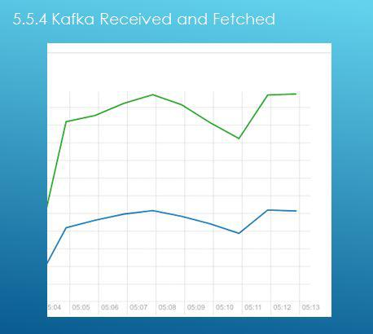

接下来讲一下 Kafka 如何做监控，其实只需要上面一幅图，上图绿色线是读 消费者，是蓝色线是写 生产者。Maxwell 生产者写到 Kafka 里面，绿色是 Spark streaming 进行消费。这幅图是实时同步架构，消息没有做积压。但是为什么绿色线会比蓝色线高，原因是数据通过 Maxwell 发送到 Kafka 时是一个 Json 数据，但是 Kafka 消费时需要额外加一些东西（来自哪个 topic、offset 是什么等），如果两条线走势是一致的，说明消息没有堆积，及时消费，稳稳的。

Bug 方面，PHOENIX-4056:java.lang.IllegalArgumentException: Can not create a Path from an empty string，先前有问题采用降版本，目前已经解决，方案在社区里有。SPARK-22968:java.lang.IllegalStateException: No current assignment for partition kssh-2，这个是 SparkStreaming 读 Kafka 时抛出的错误，这个在 Spark2.4.0 有新的补丁。\(各位道友，不要看看贵公司该架构有没有，切记打补丁哟！\)

接下来分享两个案例，分为两种，一种是 3 次 RIT，园区断电机器挂掉出现 RIT。HBase 有个 WAL，数据基本不会丢，只需要将机器重启。重启过程会有一些 RIT 操作，如果 regionserver 挂了申请维护时间，尝试重启 regionserver 节点，如果不行重启 HBase 集群，这个时候需要看 HBase 的 master 的 active 的 log 日志。还有一次是高并发内存不够用，regionserver 挂掉，重启后在 CDH 的 HBase 运行正常，但是在监控页面 HBase 还是异常，这时候只需要将 CMS 的 serviceMonitor 重启就 OK。第三次 RIT 事故 regionserver 挂掉，尝试使用 HBCK 命令修复问题还是很多。最后通过日志分析发现 Hlog 有问题，通过 HDFS 命令将文件移到某个地方，重启就 OK 了。丢失的数据通过 Maxwell 恢复，预估事故发生点，通过全表指定时间点扫描进行恢复，且要做数据量比对，行业中叫法：补数！

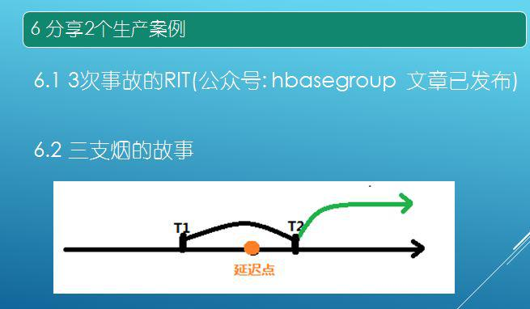

接下来分享一个三支烟的故事，数据来源于阿里云，自建机房需要通过 VPN 将数据拉倒本地机房。双十一所有仓库都在运作，MySQL 机器扛不住导致延迟比较大，延迟约半个小时。\(数据延时原因好几种结合导致的。）

需要在 T2 将数据完全恢复，解决方案直接将 Maxwell 架设到阿里云 MySQL 进行实时同步，数据进行 \[T1,T2\) 数据先刷到 HBase，将 T1 到 T2 的数据进行 SparkSQL，将计算结果写到 redis 里面, 作为基础值。SparkStreaming 进行现场改，只判断 T2 流进的数据才会将基础值 +T2 以后的数据进行累积计算，实时 Job 跑了 15 分钟数据就实时过来了，精准链路切换，不能丢数据，不能错误计算结果！\(各位道友，当然现实现场发生的，比分享的还要精彩和详细，各位可以看视频版的或和我交流。\)

### 作者介绍

**武基鹏** ，上海久耶供应链管理有限公司大数据研发工程师。主要从事大数据平台产品的技术工作；负责设计、构建和优化基于 HDFS/HBase 的存储平台架构；负责提升 Hadoop/HBase 等集群的高可用性、高性能、高扩展特性；负责基于 Spark 开发及性能调优。

本文来自武基鹏在 DataFun 社区的演讲，由 DataFun 编辑整理。
