## 数理史上的绝妙证明：准晶是高维晶体的投影  

> 作者: 返朴  
> 发布日期: 2019-05-03  

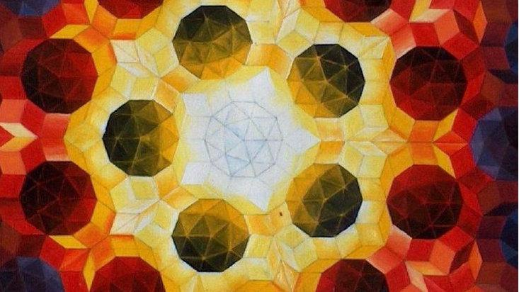

​​ **撰文 |  ** **曹则贤** （中国科学院物理研究所）

来源：《物理》

>  _晶体中原子的排列具有平移对称性，平移对称性限制了晶体只有n=1，2，3，4，6次转动对称。但发现有8次，10次，12次转动对称的准晶。准晶结构是高维晶体结构的投影。晶体和准晶的定义统一于点状衍射花样。_

### 1. 晶体没有五次旋转轴

大自然为我们呈现了一种绝美的物质结构——晶体，金刚石、水晶、硫磺等等都是天然晶体。晶体有非常规则、对称的外观。就是从晶体小面 \(facet\) 的夹角为某些固定值的观察事实，人们意识到晶体是由具有固定几何形状的单胞 \(unitcell\) 在空间中堆垛而来的——晶体学首先是几何学。

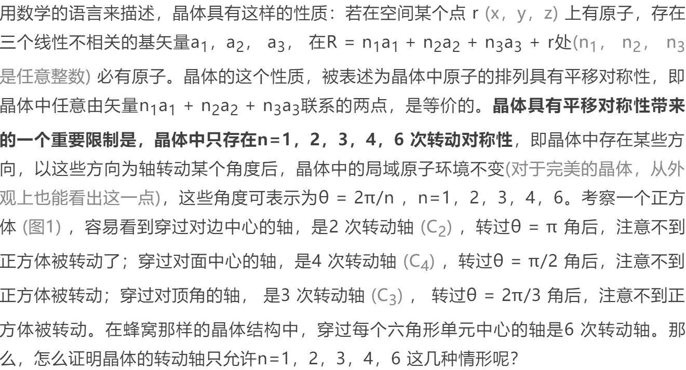

​

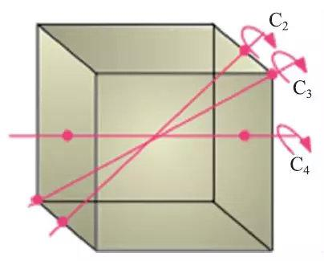
图1 正方体的2次、3次和4次转动轴

证明如下，见图2。若晶体允许n 次转轴，考察某个方向上相邻的三个原子。绕过原子O 的n 次轴将联系OA 的线段顺时针转过θ = 2π/n 角，原子A落在点A'上；绕过原子O 的n 次轴将联系OB 的线段逆时针转过θ = 2π/n 角，原子B落在点B'上。按照平移对称性和转动对称性的定义，点A' 和点B'也都是等价的原子占位，线段A' B'与AB平行，其长度必是OA长度的整数倍，即2cos \(2π/n\) 必须是个整数，解为n=1，2，3，4，6。其中，n=1是平凡的，可以忽略。关于这个问题的证明，是固体物理的常识。

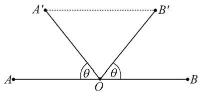
图2 平移对称与转动对称性的关联

### 2. 准  晶

细心的读者可能已经注意到了，晶体中没有5次转轴，n=5被跳过了。跳过就跳过了，没啥遗憾的，大自然的奥妙自有其合理处。但也有人把找到5次对称的铺排方式 \(Tessellation. 晶体可以理解为用同一种砖块铺满整个空间的结果\) 当成挑战。作为数学游戏，彭罗斯 \(Roger Penrose，1931-\) 于1974年给出由两种结构单元组成的彭罗斯铺排图案，该二维图案整体上具有5次转动对称性 \(图3\)。彭罗斯的铺排方案，用了两种砖块且没有平移对称性，不算晶体结构。

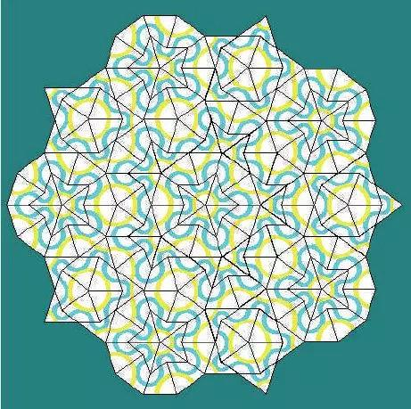
图3 一种彭罗斯铺排

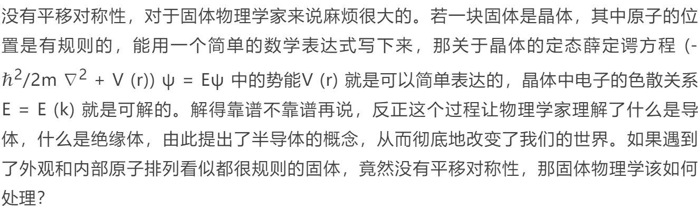

有这样的固体吗？如果没有这样的固体，为什么要杞人忧天呢？

1984年，人们在 Al-Mn 合金的透射电镜衍射图像中看到了10次对称图案，这是完美晶体中不会出现的。紧接着在很多样品中观察到了10次对称衍射花样 \(图4\) ，由此人们注意到了准晶存在 **\[1\]** 。准晶中原子排列是有序的，但没有平移对称性，所以被称为准晶 \(quasicrystal\) 。目前确认存在具有8次、10次和12次转动对称性的三维准晶。

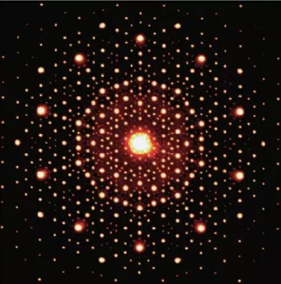
图4 AlNiCo合金的电子衍射花样

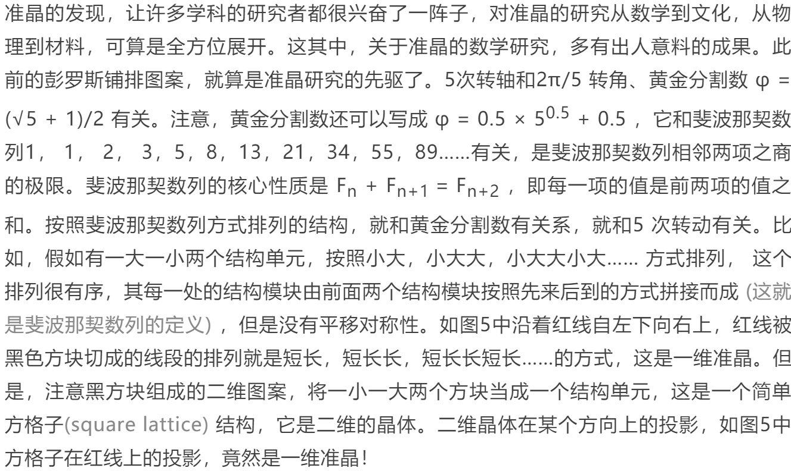

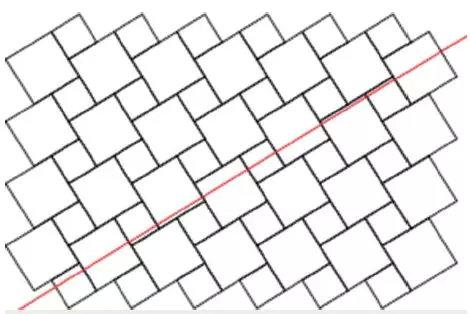
图5 由一大一小两个方块拼在一起作为单元的方格子，其在红线上的投影是斐波那契数列表

这个关于二维晶体在某个方向上的投影竟然是一维准晶的描述，不是很令人信服。请允许我给个稍微数学严谨点的表述。考察二维格子

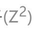

即每个格点的坐标是一对整数 \(m，n\)的方格子 **\[2\]  **\(图6\)。作直线 y = \(φ - 1\) ⋅ x 用来投影，过点 \(0，1\) 和 \(1，0\) 的作线 y = \(φ - 1\) ⋅ x的平行线\(图6 中的两条虚线\)。考察这两条平行线所形成的带状区域 \(晶格的一部分\) 中的格点，将每个格点投影到 y = \(φ - 1\) ⋅ x 直线上。你会发现，这格点的投影，相互之间只有一大一小两种间距。从这个意义上说，这些分布是有序的，但是却没有平移对称性。如果你取一部分出来观察，会发现斐波那契数列描述的分布，那些投影点形成了一维准晶。

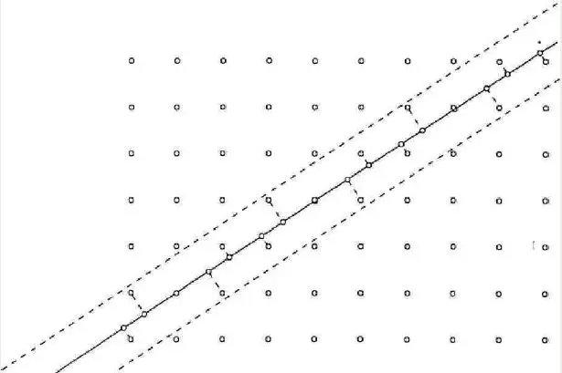

​

这太有趣啦。 **有序的准晶结构，没有平移对称性，但竟然是某个高维晶格的恰当投影**  \(投到恰当选择的低维对象上\) 。到高维空间让我们能够理解准晶隐蔽的结构。那么，准晶，都是更高维空间中某个晶体结构的投影吗？是吗，不是吗？怎么证明？

要证明准晶是高维晶体的合适的投影，一种是数学意义上的严格证明，从某些靠得住的公理、定理出发，逻辑地一步一步导出所有的准晶结构。一种是有点物理味道的证明，如果能找到合适的方法，能构造出准晶作为其投影的高维晶体结构， 摆在那儿， 那也是一种证明！

一旦明确了寻找投影为准晶结构的高维晶体这样的研究方向，对于熟悉自19世纪就发展了的高维几何的数学家来说，这还真不是难事。举一例来说明一个准备性工作，五种柏拉图固体中的正十二面体和正二十面体是具有五次转动轴的，而已发现的晶体中就有十次和十二次准晶，正十二面体就不可避免地成了关注的对象。数学家小试牛刀，发现连接着自中心到正十二面体顶点的12个矢量是六维欧几里得空间

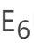

中6维正方形对角线组成的交叉到3维欧几里得空间

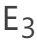

空间上的投影。1995年前后，塞内夏尔 \(M. Senechal\) 给出了能得到准晶点集的正则投影法和多格网法，非常有效地用于构造投影具有非晶体转动对称性的点集的高维晶格。比如，

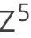

空间中的5维立方格子投影到一个面上，可以得到的点集可看作2维准晶 \(图7\) 。高维空间当然容纳更多的结构，不只是准晶结构，其它转动对称性的结构也容易找到相应的高维晶格。5次、10次、8次和12次转动对称的平面结构都可以从4维晶格得到。

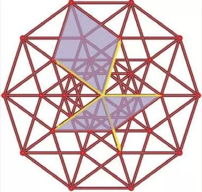图7 5维立方格子投影到一个面上可得到2维准晶\(局部\)

### 3. 维度啊维度

《三体》中有一个梗，说三体人对咱们地球人的攻击是“降维攻击”。这人与人之间的差别不在广度 \(extension\) ，拥有相同维度 \(dimension\) 的不同空间能差到哪儿去？怕就怕差在维度上。平面上有一条线，随机在平面上画点，点落到线上的概率为零。点当然可以落到那条线上，还可以有无穷多个点落到那条线上，但点落到那条线上的概率 **依然为零** ！可怜的1 维的线，面对2维的面，它都不知道自己的无穷大都是0。

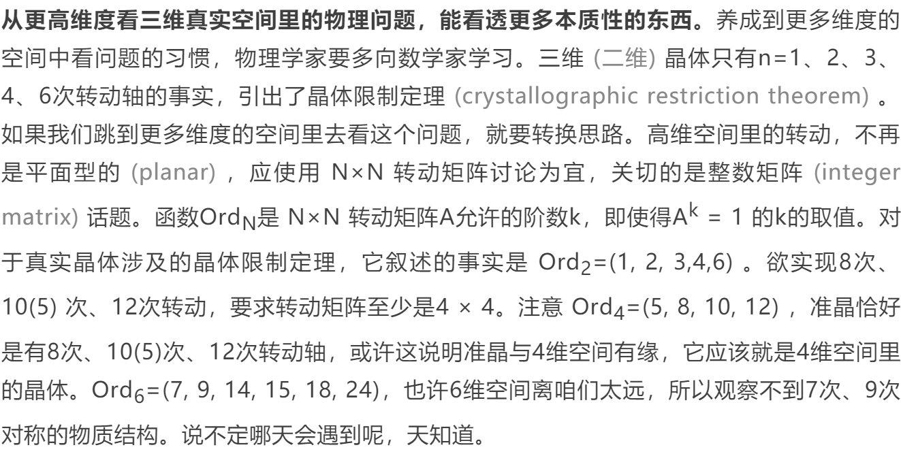

### 4. 后来的事

晶体中的原子具有平移对称性，准晶中原子排列是有序的，但不具有平移对称性。准晶与晶体有明显的可区别的特征。但是，当我们认识到准晶结构必定是高维晶体的投影，此一发现又表明晶体和准晶之间似乎没有必然的界限。坚持分别晶体和准晶涉嫌犯了执念。这事儿最终的解决方案有点儿出乎意料，原来的晶体和准晶都统一为晶体了，但是晶体的定义改变了。晶体的定义特征不再是原子排列具有平移对称性，而是说衍射图案 \(原子排列的傅里叶变换\) 由明锐的点组成的结构是晶体。

我们的世界是三维的，人类生活在二维的地表上。早在古希腊时期，关于二维、平直空间的平面几何就已经成了系统化的知识了，关于三维空间的立体几何也多有谈论，但是高维几何概念的发展要到19 世纪才由哈密顿 \(Sir William Rowan Hamilton，1805-1865\) 、凯雷 \(Arthur Cayley，1821-1895\) 、施莱夫利 \(Ludwig Schläfli，1814-1895\) 和黎曼 \(Bernhard Riemann，1826-1866\) 等人来开拓。把我们的几何观念从习惯的、可经验的三维世界拓展到四维以上的世界要延宕到19 世纪，原因除了思维惯性以外，很多人头脑中不能构建高维图形也是一个重要原因。直观不行，那就要借助数学的手段，mathematics makes the invisible visible，信矣哉！

顺便说一句，由高维晶体投影并不是得到准晶结构的唯一途径。笔者的学生廖龙光博士就用函数 y = arcsin \(sin\(2πμn\)\) ，其中变量n取整数， μ =√2 - 1 和 μ =2 -√3 ，分别得到了8次和12次准晶结构。这里的奥秘是，熟悉相关的数学并且不辞辛苦地尝试。旁人能看到的是研究者的灵感，但灵感来自实践。

**注释**

\[1\]  准晶虽然是在人工样品中先发现的，但大自然中存在准晶结构的矿物，准晶原子结构花样此前也早被人类作为纯粹的装饰图案构思出来了。

\[2\]  也可以把坐标\(m，n\)表示成m+i·n。这样的复数称为高斯整数，笔者就是利用高斯整数证明了方格子在无穷多个方向上具有缩放对称性，参见笔者著《一念非凡》。

**参考文献**

\[1\] Senechal M. Quasicrystals and geometry. Cambridge University Press，1995

\[2\] Sadoc Jean-François，Mosseri R. A new method to generate quasicrystalline structures：examples in 2D tilings. J. Phys. France，1990，51：205

\[3\] Liao L G，Cao Z X. Directional scaling symmetry of high symmetry two-dimensional lattices. Scientific Reports，2014，4：6193

**版权声明：本文选自《物理》2019年第4期，经授权转载自“中国物理学会期刊网”。**

《返朴》，致力好科普。国际著名物理学家文小刚与生物学家颜宁联袂担任总编，与几十位学者组成的编委会一起，与你共同求索。关注《返朴》（微信号：fanpu2019）参与更多讨论。二次转载或合作请联系fanpu2019@outlook.com。

相关阅读

1  [数理史上的绝妙证明：柏拉图多面体只有五种 | 贤说八道](http://mp.weixin.qq.com/s?__biz=MzUxNzQyMjU5NQ==&mid=2247484089&idx=1&sn=3647e2ffe59b2e9cf884e728ea551337&chksm=f99929d5ceeea0c397141170adf8fd1fd68687db1a71671aec2ab85bf9781f9c233b039fe396&scene=21#wechat_redirect)

2  [数理史上的绝妙证明](http://mp.weixin.qq.com/s?__biz=MzUxNzQyMjU5NQ==&mid=2247483965&idx=1&sn=1f1760be291655bc9b1c4e191f2bc6f3&chksm=f9992951ceeea047087de49da08f23d67581315620b5bbac03708aa1cb4e4cffb8d8504a3635&scene=21#wechat_redirect)[：晶体的点群与空间群](http://mp.weixin.qq.com/s?__biz=MzUxNzQyMjU5NQ==&mid=2247483863&idx=2&sn=32bbae484935921b44fa3f81ed73d172&chksm=f9992abbceeea3adf952a2f8754f5c157f374545e6dfec1b002f8c3e5dbc7c635a3d18b47622&scene=21#wechat_redirect)[｜贤说八道](http://mp.weixin.qq.com/s?__biz=MzUxNzQyMjU5NQ==&mid=2247483965&idx=1&sn=1f1760be291655bc9b1c4e191f2bc6f3&chksm=f9992951ceeea047087de49da08f23d67581315620b5bbac03708aa1cb4e4cffb8d8504a3635&scene=21#wechat_redirect)

2  [数理史上的绝妙证明：六角密堆积证明及其它｜贤说八道](http://mp.weixin.qq.com/s?__biz=MzUxNzQyMjU5NQ==&mid=2247483965&idx=1&sn=1f1760be291655bc9b1c4e191f2bc6f3&chksm=f9992951ceeea047087de49da08f23d67581315620b5bbac03708aa1cb4e4cffb8d8504a3635&scene=21#wechat_redirect)​​​​
