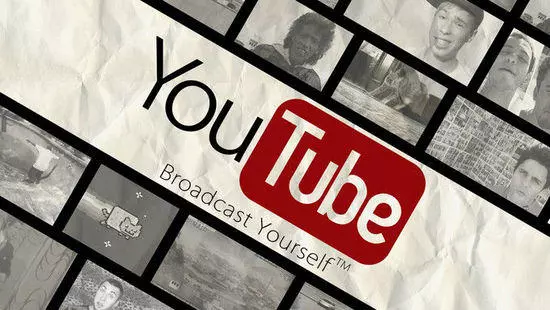
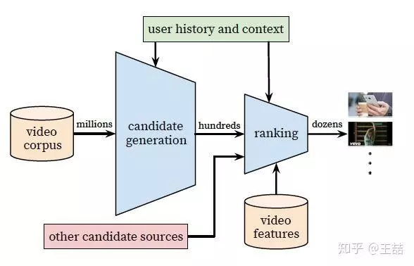
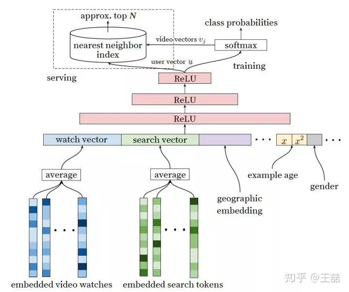
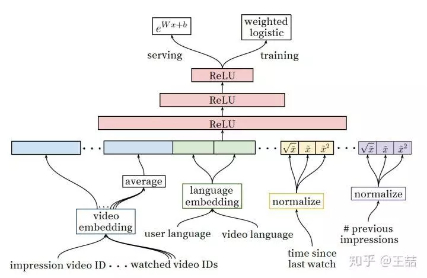

## 重读Youtube深度学习推荐系统论文，字字珠玑，惊为神文

  

> 论文导读  AI前线  1/6
> 来源 | 授权转载自王喆的机器学习笔记
> 作者 | 硅谷高级机器学习工程师 王喆
> 编辑 | Vincent

这周我们一起讨论一下 Youtube 的深度推荐系统论文《Deep Neural Networks for YouTube Recommendations》，这是 2016 年的论文，按照今天的标准来看，已经没有什么新颖的地方，我也是两年前读过这篇文章之后就放下了，但前几天重读这篇文章，竟让发现了诸多亮点，几乎处处是套路，处处是经验，不由惊为神文。这篇神文给我留下的深刻印象有两点：

* 这毫无疑问是工业界论文的典范，是我非常推崇的工程导向的，算法工程师必读的文章；

* 我以为毫不起眼的地方，也藏着 Youtube 工程师宝贵的工程经验，相比上周介绍的阿里的深度兴趣网络 DIN，最重要的价值就在于 Attention 机制，这篇文章你应该精确到句子来体会，这是我惊为神文的原因。

废话不多说，下面就跟大家分享一下两次拜读这篇论文的不同体验和收获。

论文地址：[Deep Neural Networks for YouTube Recommendations.pdf](https://github.com/wzhe06/Reco-papers/blob/master/Recommendation/Deep%20Neural%20Networks%20for%20YouTube%20Recommendations.pdf)

第一遍读这篇论文的时候，我想所有人都是冲着算法的架构去的，在深度学习推荐系统已经成为各大公司“基本操作”的今天，Youtube 在算法架构上并无惊奇之处，我们来快速介绍一下文章中的深度学习推荐系统的算法架构。

  

Youtube 的用户推荐场景自不必多说，作为全球最大的 UGC 的视频网站，需要在百万量级的视频规模下进行个性化推荐。由于候选视频集合过大，考虑 online 系统延迟问题，不宜用复杂网络直接进行推荐，所以 Youtube 采取了两层深度网络完成整个推荐过程：

* 第一层是 Candidate Generation Model 完成候选视频的快速筛选，这一步候选视频集合由百万降低到了百的量级。

* 第二层是用 Ranking Model 完成几百个候选视频的精排。

首先介绍 candidate generation 模型的架构

  

我们自底而上看这个网络，最底层的输入是用户观看过的 video 的 embedding 向量，以及搜索词的 embedding 向量。至于这个 embedding 向量是怎么生成的，作者的原话是这样的

> Inspired by continuous bag of words language models, we learn high dimensional embeddings for each video in a xed vocabulary and feed these embeddings into a feedforward neural network

所以作者是先用 word2vec 方法对 video 和 search token 做了 embedding 之后再作为输入的，这也是做 embedding 的“基本操作”，不用过多介绍；当然，除此之外另一种大家应该也比较熟悉，就是通过加一个 embedding 层跟上面的 DNN 一起训练，两种方法孰优孰劣，有什么适用场合，大家可以讨论一下。

特征向量里面还包括了用户的地理位置的 embedding，年龄，性别等。然后把所有这些特征 concatenate 起来，喂给上层的 ReLU 神经网络。

三层神经网络过后，我们看到了 softmax 函数。这里 Youtube 的同学们把这个问题看作为用户推荐 next watch 的问题，所以输出应该是一个在所有 candidate video 上的概率分布，自然是一个多分类问题。

好了，这一套深度学习的“基本操作”下来，就构成了 Youtube 的 candidate generation 网络，看似平淡无奇，其实还是隐藏着一些问题的，比如：
 
1. 架构图的左上角，为什么在 online serving 的时候不直接用这套网络进行预测而要使用 nearest neighbor search 的方法？
2. 多分类问题中，Youtube 的 candidate video 有百万之巨，意味着有几百万个分类，这必然会影响训练效果和速度，如何改进？

这些问题在读第一遍的时候我也没有深想深看，但却是工程实现中必然会遇到的问题，我们随后再深入介绍论文中的解决方法。

既然得到了几百个候选集合，下一步就是利用 ranking 模型进行精排序，下面是 ranking 深度学习网络的架构图。

  

乍一看上面的 ranking model 似乎与 candidate generation 模型没有什么区别，模型架构还是深度学习的“基本操作”，唯一的区别就是特征工程，那么我们就讲讲特征工程。

事实上原文也明确说明了，引入另一套 DNN 作为 ranking model 的目的就是引入更多描述视频、用户以及二者之间关系的特征，达到对候选视频集合准确排序的目的。

> During ranking, we have access to many more features describing the video and the user's relationship to the video because only a few hundred videos are being scored rather than the millions scored in candidate generation.

具体一点，从左至右的特征依次是：
 
1. impression video ID embedding：当前要计算的 video 的 embedding；
2. watched video IDs average embedding：用户观看过的最后 N 个视频 embedding 的 average pooling；
3. language embedding：用户语言的 embedding 和当前视频语言的 embedding；
4. time since last watch：自上次观看同 channel 视频的时间；
5. #previous impressions：该视频已经被曝光给该用户的次数。

上面五个特征中，我想重点谈谈第 4 个和第 5 个。因为这两个很好的引入了对用户行为的观察。

第 4 个特征背后的思想是

> We observe that the most important signals are those that describe a user's previous interaction with the item itself and other similar items.

有一些引入 attention 的意思，这里是用了 time since last watch 这个特征来反应用户看同类视频的间隔时间。从用户的角度想一想，假如我们刚看过“DOTA 经典回顾”这个 channel 的视频，我们很大概率是会继续看这个 channel 的视频的，那么该特征就很好的捕捉到了这一用户行为。

第 5 个特征 #previous impressions 则一定程度上引入了 exploration 的思想，避免同一个视频持续对同一用户进行无效曝光。尽量增加用户没看过的新视频的曝光可能性。

至此，我的第一遍论文阅读就结束了，对 Youtube 的算法框架有了概念，但总觉得不过如此，没什么太多新颖的地方。。

但如果真这么想，还是太 naive 了，与上一篇阿里的深度兴趣网络 DIN 不同的是，你读懂了 DIN 的 attention 机制，你就抓住了其论文 70% 的价值，但这篇文章，如果你只读懂了 Youtube 的推荐系统架构，你只抓住了 30% 的价值。那么剩下的 70% 的价值在哪里呢？

在重读这篇文章的时候，我从一个工程师的角度，始终绷着“如何实现”这根弦，发现这篇论文的工程价值之前被我大大忽略了。下面我列出十个文中解决的非常有价值的问题：

1. 文中把推荐问题转换成多分类问题，在 next watch 的场景下，每一个备选 video 都会是一个分类，因此总共的分类有数百万之巨，这在使用 softmax 训练时无疑是低效的，这个问题 Youtube 是如何解决的？
2. 在 candidate generation model 的 serving 过程中，Youtube 为什么不直接采用训练时的 model 进行预测，而是采用了一种最近邻搜索的方法？
3. Youtube 的用户对新视频有偏好，那么在模型构建的过程中如何引入这个 feature？
4. 在对训练集的预处理过程中，Youtube 没有采用原始的用户日志，而是对每个用户提取等数量的训练样本，这是为什么？
5. Youtube 为什么不采取类似 RNN 的 Sequence model，而是完全摒弃了用户观看历史的时序特征，把用户最近的浏览历史等同看待，这不会损失有效信息吗？
6. 在处理测试集的时候，Youtube 为什么不采用经典的随机留一法（random holdout），而是一定要把用户最近的一次观看行为作为测试集？
7. 在确定优化目标的时候，Youtube 为什么不采用经典的 CTR，或者播放率（Play Rate），而是采用了每次曝光预期播放时间（expected watch time per impression）作为优化目标？
8. 在进行 video embedding 的时候，为什么要直接把大量长尾的 video 直接用 0 向量代替？
9. 针对某些特征，比如 #previous impressions，为什么要进行开方和平方处理后，当作三个特征输入模型？
10. 为什么 ranking model 不采用经典的 logistic regression 当作输出层，而是采用了 weighted logistic regression？

因为我也是在视频推荐领域工作，所以可以很负责任的说以上的十个问题都是非常有价值的。
