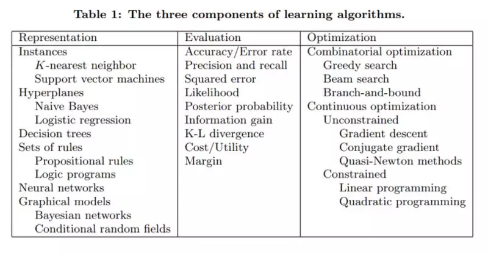
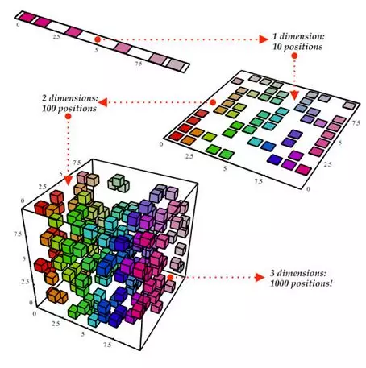
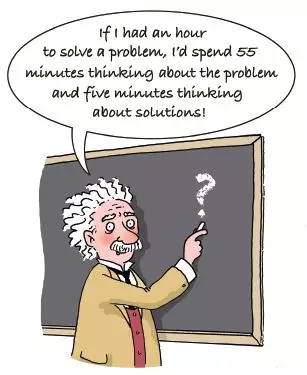
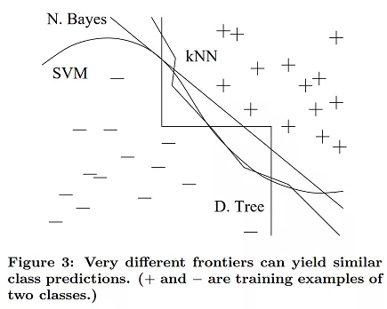
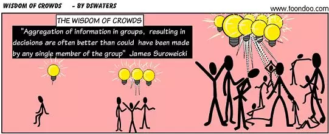
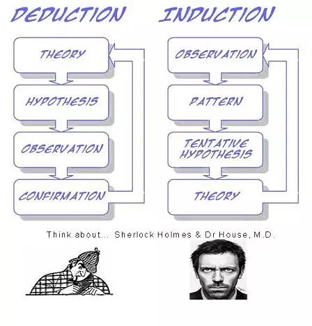
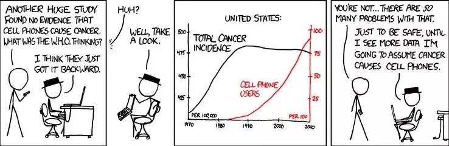

## 写给机器学习从业者的12条宝贵建议

  

> 原创： AI前线小组 译  AI前线  昨天
> 作者 | Samia Khalid
> 译者 | 杨雷
> 编辑 | Vincent

机器学习算法承诺，通过学习数据，能够弄清楚如何执行重要任务。也就是说，在不被明确告知要做什么的情况下，从样例中归纳出来某种结论。这意味着数据量越大，问题就越容易处理。然而，开发成功的机器学习应用程序 需要相当多的所谓“黑科技”，这很难在课本或机器学习入门课程中找到。

最近偶然发现了 Pedro Domingos 教授 的一篇很好的研究论文， 该论文汇集了机器学习研究人员和从业者的经验教训。在这篇文章中，我将与你一起学习这些宝贵的教训。

准备好了解：要避免的陷阱，要关注的重要问题，以及一些常见问题的答案。

1. 学习 = 表征 + 评估 + 优化

你有一个应用程序，你认为机器学习可能是一个很好的选择。现在，一旦进入机器学习的世界，有大量的学习算法可供使用，每年发布数百种。用哪一个？

  

在这个巨大的空间中不迷路的关键，是要理解所有学习算法都包含三个核心要素：

表征（Representation）：  输入数据，即要使用的特征，学习器（learner）和分类器（classifier）必须以计算机可以理解的语言表示。学习器可以训练的分类器的集合称为学习器的假设空间。如果分类器不在假设空间中，则无法进行学习。

* 说明：我们所说的 分类器与学习器 的含义是什么？假设有训练数据，并使用该数据构建另  一个程序（模型），例如决策树。学习器将是从输入数据构建决策树模型的程序，而 决策树模型将是 分类器（能够为每个输入数据样本提供预测输出的东西）。
* 评估（Evaluation）：  需要一个评价函数来区分好的分类器和坏的分类器。算法内部使用的评估函数是一个，而我们希望的分类器的外部评估函数可能是另外一个（为了便于优化，也由于后面讨论的问题）。
* 优化（Optimization）：  最后，我们需要一种方法来搜索分类器，以便我们可以选择最好的分类器。优化技术的选择是提高学习器效率的关键。开始时使用现成的优化器是很常见的做法，如果需要的话，可以稍后用自定义的来替换它。

下表显示了这三个组件中每个组件的一些常见示例。

  

2. 泛化很重要

机器学习的基本目标是 超越训练集中的样本进行泛化。因为，无论我们有多少数据，我们都不太可能在测试时再次看到这些确切的样本。在学习上表现出色很容易，初学者最常见的错误是对训练数据进行测试并产生成功的假象。如果选择分类器然后在新的数据上进行测试，这样做通常不会比随机猜测更好。所以，从一开始就把 一些数据 放在一边，只在最后用它来测试所选的分类器，然后在整个数据上学习那个最终的分类器。

当然，保留数据会减少可供学习的数据量，这可以通过进行 交叉验证 来缓解：将训练数据随机划分为（例如）10 个子集，每次用其中 9 个子集进行训练，用剩下的一个样本测试学习后的分类器，权衡它们的结果来评估特定参数的设置效果如何。

3. 仅有数据是不够的

把泛化当成目标时，会遇到另一个主要的后果：不管有多少数据，单凭数据是不够的。假设我们想从一百万个样本中学习 100 个变量的布尔函数（yes/no 分类），这意味着有 2^100-10^6 个不知道是什么分类的样本。在没有更多信息的情况下，这怎么能比抛硬币更有效呢？

听起来我们被卡住了吧？幸运的是，我们想要在现实世界中学习到的函数，并不是从所有数学上可能的函数一步步地推导出来的！事实上，非常一般的假设 -- 比如相似的样本有相似的分类 -- 是机器学习能成功的一个重要原因。

这意味着 领域知识和对数据的理解 对于做出正确的假设非常重要。学习过程中对知识的需要是很自然的，机器学习不是魔术，它不能从虚无中得到什么，它所做的是从较少的数据中得到更多的信息。与所有的工程一样，编程也是一项艰巨的工作：我们必须从头开始构建一切。学习更像是农业耕作，让大自然做大部分的工作，而农民把种子和营养物质结合起来种植农作物。学习器 将知识与数据结合 起来，以编出程序。

4. 过拟合的多种面孔

过拟合的问题是机器学习中令人烦恼的事。当学习器输出一个对训练数据 100％准确，但对测试数据只有 50％准确的分类器时，实际上它可以输出一个对两者的准确度都为 75％的分类器，这时已经过拟合了。

熟悉机器学习的每个人都知道过拟合，但它有多种形式，并不是很明显。理解过拟合的一种方法是将泛化误差分解为 偏差和方差。

偏差是学习器 一直学习同样错误。无论真实情况如何，方差是 学习 与真实信号无关的 随机事物。用飞镖来类比可以更好地理解这一点，如下图所示：

  

例如，线性学习器具有较高的偏差，因为当两个类之间的划分不是一个清晰的超平面时，学习器无法正确地推导出某种关系。决策树没有这个问题，因为它们的学习方法很灵活。但另一方面，它们可能会有较高的方差， 在同一任务的不同训练数据集上学习的决策树通常区别很大，虽然实际上它们应该是相同的。

那么现在，如何应对过拟合？

交叉验证 可以解决这个问题，例如通过它来选择要学习的决策树的最佳大小。但请注意，这里还有一个问题：如果选择了太多的参数，从开始可能就会过拟合，这样又陷入了同样的陷阱。

除了交叉验证之外，还有许多方法可以对抗过拟合。最受欢迎的是在评估函数中添加 正则化 项，另一个选择是执行类似卡方检验这样的统计显著性检验，以更多分析复杂性的增加是否会对类的分布产生任何影响。这里的一个重点是没有特定的技术“解决”过拟合问题。例如，可以通过陷入欠拟合（偏差）来避免过拟合（方差）。同时，不要试图学习出一个完美的分类器，并没有一种技术总能做到最好（没有免费的午餐）。

5. 直觉在高维空间中失效

紧随过拟合之后，机器学习中最大的问题是 维数的诅咒。这意味着如果输入是高维的，许多在低维度下正常工作的算法会变得难以处理。由于固定大小的训练集只覆盖了输入空间的一小部分（可能的组合变得巨大），因此随着样本 维度（即特征的数量） 的增长，正确泛化的难度呈指数增加。但这就是机器学习既有必要又有困难的原因。如下图所示，即使从 1-D 过渡到 3-D，分辨出不同样本的工作似乎开始变得越来越难——在高维度上，所有的样本看起来都是一样的。

  

这里的问题是，来自三维世界的直觉在高维度上失效。例如高维的橘子，大部分体积都在果皮里，而不是果肉里！

难以置信的是：如果固定数量的样本在高维超立方中均匀分布，并且，如果我们通过将其嵌入超立方中来近似超球面，那么在高维空间中，超立方体的几乎所有体积都在超球体之外。这是个坏消息，因为在机器学习中，一种类型的形状常常通过另一种类型的形状近似。

注意：你可能已经被所有这些“超（hyper）”给弄糊涂了，超立方内部的超球面在二维和三维空间中看起来会像下面这样：

  

因此，现在可以理解，构建 2 维或 3 维的分类器很容易。但在高维度上，很难理解发生了什么。反过来，这让设计好的分类器变得困难。事实上，我们经常陷入这样的陷阱：认为收集更多的特征永远不会有害，因为在最坏的情况下，它们不会提供关于类的新信息。但事实上，维度的诅咒带来的问题会超过它们的好处。

建议：下次当考虑添加更多特征时，请考虑当维度变得太大时可能带来的潜在问题。

6. 特征工程是关键

最终，有些机器学习项目会成功，有些会失败。有什么区别？最重要的因素很容易识别，就是所使用的特征。如果有许多独立的特征，每一个都与类密切相关，那么学习就很容易。另一方面，如果类是一个配方，在使用前需要以复杂的方式处理其成分（特征），那么事情就会变得更加困难，特征工程基本上是从现有的特征中 创建新的输入特征。

通常，原始数据的形式并不适合学习，不过可以从中构建可用于学习的特征。事实上，这通常是机器学习项目中的大部分工作。它通常也是最有趣的部分之一，直觉、创造力和“暗黑艺术”，与技术一样重要。

第一次尝试机器学习的人通常会惊讶于实际花费在机器学习项目上训练的时间如此之少。但是，如果考虑到收集数据、整合数据、清理数据和预处理数据是多么耗时，以及在特征设计中可以进行多少尝试和遇到多少错误，那么这就可以理解了。此外，机器学习不是构建数据集和运行学习器的 一次性过程，而是运行学习器、分析结果、修改数据和 / 或学习器的重复迭代过程。训练往往是最快的一部分，但那是因为我们已经很好地掌握了它！特征工程更为困难，因为它是特定领域的，而学习器基本上可以是通用的。当然，机器学习的圣杯之一就是自动化越来越多的特征工程过程。

  

7. 更多的数据击败更聪明的算法

假设已经构建了尽可能好的一组特征，但是得到的分类器仍然不够精确。你现在能做什么？主要有两种选择：设计一个更好的学习算法，或者收集更多的数据（更多的样本，可能还有更多的原始特征）。机器学习研究人员会致力于改进设计，但在现实世界中，最快的成功之路往往是获取更多的数据。

根据经验法则，一个拥有大量数据的傻瓜算法比一个拥有少量数据的聪明算法要好。

通常在计算机科学中，两个主要的有限资源是时间和内存。在机器学习中，还有第三个：训练数据。在这三者之中，今天的主要瓶颈通常是时间——大量数据可用，但没有足够的时间来处理它，导致数据并没有被好好利用。这意味着 在实践中，更简单的分类器 最终会得到好的结果，因为复杂的分类器需要很长时间才能学习。

更聪明的算法并不能得到更好的结果的部分原因是，它们最终都在做同样的事情 -- 所有的学习器基本上都是通过将附近的样本分组到同一个类中来工作的，关键的区别在于“附近”的含义。当数据的分布不均匀时，即使比较复杂的学习器也可以产生差别很大的分类结果边界，他们最终仍然会 在重要区域（具有大量训练样本的区域，也可能是大多数测试样本出现的地方）做出相同的预测。如下图所示，无论是一条奇特的曲线、一条直线还是一个阶梯边界，最终都可以得到相同的预测：

  

通常，首先 尝试最简单的学习器（例如，逻辑回归之前的朴素贝叶斯，支持向量机之前的 k- 最近邻）。更复杂的学习器是诱人的，但通常更难使用，因为它们需要转动更多的旋钮来获得好的结果，并且它们的内部更像是黑盒子。

8. 学习许多模型，而不只是一个

在机器学习的早期，人们会努力尝试许多不同的学习器，然后选择最好的。但后来研究人员注意到，如果我们不选择所发现的最佳学习器，而是将许多学习器组合在一起，结果会更好（通常会更好），而且对用户来说几乎没有额外的工作。创建这样的模型 集合 现在非常常见：

* 在最简单的技术（称为 bagging）中，我们使用相同的算法，对原始数据的不同子集进行训练。最后，我们只需要权衡这些结果，或通过某种投票机制将它们结合起来。
* 在 boosting 技术中，学习器依次接受训练。随后每一个都将大部分注意力放在前一个预测失误的数据点上，一直到对结果满意为止。
* 在 stacking 技术中，相互独立的分类器的输出作为新分类器的输入，直到给出最终的预测结果。

在 Netflix Prize 竞赛中，来自世界各地的团队竞相构建最佳的视频推荐系统。随着比赛的进行，团队发现，将他们的学习器与其他团队的相结合获得了最佳结果，进而他们合并为越来越大的团队。优胜者和亚军都是超过 100 个学习器的组合，这两个组合的结合进一步提高了效果。在一起更好！

  

9. 理论并不能保证什么

机器学习论文充满理论上的保证，对这些保证我们能做些什么？归纳法传统上是与演绎法相对立的：在演绎法中，可以保证结论是正确的；但在归纳法中，情况则截然不同。近几十年的主要发展之一是认识到，事实上，如果我们愿意接受概率上的保证，就可以保证归纳的结果。

  

例如，可以保证，如果给定足够大的训练集，并且具有很高的概率，那么学习器将返回一个泛化得很好的假设，或者找不到一致的假设。

另一种常见的理论保证是，给定无限的数据，学习器可以保证输出正确的分类器。在实践中，由于我们前面讨论的偏差 / 方差的情况，如果学习器 A 比学习器 B 在给定的无限数据下更好，则 B 在给定有限数据的情况下通常比 A 更好。

理论上的保证在机器学习中的主要作用 不是作为实际决策的标准， 而是理解算法设计的源泉。

10. 简单并不意味着准确

在机器学习中，奥卡姆剃刀定律通常被认为是指，如果两个分类器具有相同的训练错误，两个分类器中较简单的分类器可能具有较低的测试误差。

  

但事实并非如此，我们在前面看到了一个反例：即使在训练误差为零之后，通过添加分类器进行增强的分类器组合的泛化误差仍在不断地增加。与直觉相反，模型的参数数量与其过拟合的倾向之间没有必然的联系。也就是说，在机器学习中，更简单的假设仍然是首选，因为 简单本身就是一种美德，而不是因为它意味着准确性。

11. 可表征并不意味着可学习

函数可以被表征，并不意味着它可以被学习。例如，标准的决策树学习器不能学习叶节点多于训练样本的树。

给定有限的数据、时间和内存，标准的学习器只能学习所有可能函数的一小部分，而这些子集对于具有不同表征的学习器是不同的。因此，关键在于 尝试不同的学习器（并尽可能将它们结合起来）是 值得的。

12. 相关性并不意味着因果关系

我们都听说过，相关性并不意味着因果关系，但人们仍然倾向于认为相关性意味着因果关系。

  

通常，学习预测模型的目标是将它们用作行动指南。如果我们发现啤酒和尿布经常在超市被一起买走，那么把啤酒放在尿布区旁边 或许 会增加销量。但除非我们进行实际的实验，否则很难判断这是否属实。相关性是潜在因果关系 的标志，我们可以将其作为 进一步调查的指南，而不是作为我们的最终结论。

**结  论**

像任何一门学科一样，机器学习也有许多的“民间智慧”，虽然很难获得，但对成功至关重要。

原文链接：[12-key-lessons-from-ml-researchers-and-practitioners](https://towardsml.com/2019/04/09/12-key-lessons-from-ml-researchers-and-practitioners/)
